([Français](#journal-des-modifications))

# Changelog

All notable changes to this project will be documented in this file.

## [2.2.0](https://github.com/cds-snc/gcds-tokens/compare/gcds-tokens-v2.1.0...gcds-tokens-v2.2.0)

Released on: 2025-01-30

### :rocket: New Features

* Add breadcrumb item font token ([#380](https://github.com/cds-snc/gcds-tokens/issues/380)) ([c4526e5](https://github.com/cds-snc/gcds-tokens/commit/c4526e5617db99bb180857c339d0d709c7c86d60))
* Update language toggle tokens for mandatory elements alignment ([#379](https://github.com/cds-snc/gcds-tokens/issues/379)) ([9323afb](https://github.com/cds-snc/gcds-tokens/commit/9323afb708c7ea67d2e4b74fb6d5bf9f5a64d76e))
* Update search component tokens ([#382](https://github.com/cds-snc/gcds-tokens/issues/382)) ([5e624d1](https://github.com/cds-snc/gcds-tokens/commit/5e624d173389a90fb42cf70abef170ee71fbdad0))

### :bug: :wrench: Bug Fixes

* adjust language-toggle padding to match design ([#383](https://github.com/cds-snc/gcds-tokens/issues/383)) ([b20b9ea](https://github.com/cds-snc/gcds-tokens/commit/b20b9eaa4f04d7935c68bc5958e10871ef1762b3))

### :no_entry: Remove

* Remove search component tokens ([#384](https://github.com/cds-snc/gcds-tokens/issues/384)) ([8c3d4d1](https://github.com/cds-snc/gcds-tokens/commit/8c3d4d12bf8f42406fac200bada5adce6be7c65e)) 
    - `--gcds-search-border-radius`
    - `--gcds-search-focus-border-radius`
    - `--gcds-search-font-desktop`
    - `--gcds-search-font-mobile`
    - `--gcds-search-min-width-and-height`

## [2.1.0](https://github.com/cds-snc/gcds-tokens/compare/gcds-tokens-v2.0.4...gcds-tokens-v2.1.0) (2025-01-14)

### :no_entry: Remove

* removed the deprecated grid gap token `gcds-grid-gap` (see new grid gap value options) ([#377](https://github.com/cds-snc/gcds-tokens/issues/377)) ([eba1d0a](https://github.com/cds-snc/gcds-tokens/commit/eba1d0a80d76a401ebc5972e7d657246b0261b20))

### :rocket: New Features

* add grid gap value options for more flexibility ([#375](https://github.com/cds-snc/gcds-tokens/issues/375)) ([23d000c](https://github.com/cds-snc/gcds-tokens/commit/23d000ce1aa89c213a3591478109981496534eca))

| Grid Gap Token | Value   |
|----------|---------|
| gcds-grid-gap-150 | 0.75rem  |
| gcds-grid-gap-175 | 0.875rem |
| gcds-grid-gap-200 | 1rem     |
| gcds-grid-gap-225 | 1.125rem |
| gcds-grid-gap-250 | 1.25rem  |
| gcds-grid-gap-300 | 1.5rem   |
| gcds-grid-gap-350 | 1.75rem  |
| gcds-grid-gap-400 | 2rem     |
| gcds-grid-gap-450 | 2.25rem  |
| gcds-grid-gap-500 | 2.5rem   |
| gcds-grid-gap-550 | 2.75rem  |
| gcds-grid-gap-600 | 3rem     |
| gcds-grid-gap-650 | 3.25rem  |
| gcds-grid-gap-700 | 3.5rem   |
| gcds-grid-gap-750 | 3.75rem  |
| gcds-grid-gap-800 | 4rem     |

### :arrows_counterclockwise: Code Refactoring

* update breadcrumb item margin ([#373](https://github.com/cds-snc/gcds-tokens/issues/373)) ([79235ef](https://github.com/cds-snc/gcds-tokens/commit/79235ef8bc18e1b78f57fbc23c57d3ee8fa10495))

## [2.0.4](https://github.com/cds-snc/gcds-tokens/compare/gcds-tokens-v2.0.3...gcds-tokens-v2.0.4)

Released on: 2025-01-08

### :arrows_counterclockwise: Code Refactoring

* update component spacing ([#371](https://github.com/cds-snc/gcds-tokens/issues/371)) ([48d1d2f](https://github.com/cds-snc/gcds-tokens/commit/48d1d2f715e92adecc1400a0c984d02965646609))

## [2.0.3](https://github.com/cds-snc/gcds-tokens/compare/gcds-tokens-v2.0.2...gcds-tokens-v2.0.3)

Released on: 2024-12-17

### :art: Styles

* improve print design for details component ([#367](https://github.com/cds-snc/gcds-tokens/issues/367)) ([6581990](https://github.com/cds-snc/gcds-tokens/commit/65819904824e6febd91d3f42d327b5a37adc1bcb))

## [2.0.2](https://github.com/cds-snc/gcds-tokens/compare/gcds-tokens-v2.0.1...gcds-tokens-v2.0.2)

Released on: 2024-12-16

### :arrows_counterclockwise: Code Refactoring

* adjust form element spacing ([#365](https://github.com/cds-snc/gcds-tokens/issues/365)) ([e459947](https://github.com/cds-snc/gcds-tokens/commit/e459947ddb2d2d5c93370fffcf2065a4269195b2))
* remove global font token for label ([#366](https://github.com/cds-snc/gcds-tokens/issues/366)) ([1a00c70](https://github.com/cds-snc/gcds-tokens/commit/1a00c70120c1dee9aabf28b97c4745035f169dca))

## [2.0.1](https://github.com/cds-snc/gcds-tokens/compare/gcds-tokens-v2.0.0...gcds-tokens-v2.0.1)

Released on: 2024-12-11

### :bug: :wrench: Bug Fixes

* adjust breadcrumbs item margin + details padding after typography & spacing update ([#353](https://github.com/cds-snc/gcds-tokens/issues/353)) ([31df600](https://github.com/cds-snc/gcds-tokens/commit/31df600fa297911989ccd0eda397c8ed6da29c61))
* updated the Notice heading spacing to use new tokens ([#351](https://github.com/cds-snc/gcds-tokens/issues/351)) ([959840d](https://github.com/cds-snc/gcds-tokens/commit/959840ddb2027875a57b684d0f32d86cf790bdec))

## [2.0.0](https://github.com/cds-snc/gcds-tokens/compare/gcds-tokens-v1.20.2...gcds-tokens-v2.0.0)

Released on: 2024-12-05

### :rotating_light: Breaking changes
* **add new typography and spacing values** ([#345](https://github.com/cds-snc/gcds-tokens/issues/345)) ([0aebdc1](https://github.com/cds-snc/gcds-tokens/commit/0aebdc1343213e66ffa55fab1abacf4c51bfe595))

We have updated our typography and spacing tokens as part of ongoing efforts to align with Canada.ca Specifications

_**If you are using this package**_
Upgrade your version number to this release version to receive the changes in font sizes, line heights and spacing values.

Reference the [visual mapping table](#spacing-tokens-visual-mapping-guide) to update your design tokens for margins and paddings. The image/table compares the old spacing token values with the new ones, helping you identify the equivalent token to use. Review the chart to match your current values with their updated counterparts.

- [What are the changes?](#what-are-the-changes)
  - [Font sizes](#font-sizes)
    - [Desktop](#desktop)
    - [Mobile](#mobile)
  - [Line heights](#line-heights)
    - [Desktop](#desktop-1)
    - [Mobile](#mobile-1)
  - [Spacing](#spacing)
  - [Changes to some token names](#changes-to-some-token-names)
  - [Spacing tokens visual mapping guide](#spacing-tokens-visual-mapping-guide)

#### What are the changes?
The following design tokens have new values for font sizes, line heights and spacing.

##### Font sizes
###### Desktop
Token | Element | Font size (px) | Font size (rem) | Line height
| :--- | :---: |  :---: |  :--- |  :---: |
`gcds-font-sizes-h1 `| H1 | 41px | 2.5625rem | 117%
`gcds-font-sizes-h2` | H2 | 39px | 2.4375rem | 123%
`gcds-font-sizes-h3` | H3 | 29px | 1.8125rem | 137%
`gcds-font-sizes-h4` | H4 | 27px | 1.6875rem | 133%
`gcds-font-sizes-h5` | H5 | 24px | 1.5rem | 133%
`gcds-font-sizes-h6` | H6 | 22px | 1.375rem | 145%
`gcds-font-sizes-text` | Label \| Text \| Mono | 20px | 1.25rem | 160%
`gcds-font-sizes-text-small` | Small Text | 18px | 1.125rem | 155%

###### Mobile
Token | Element | Font size (px) | Font size (rem) | Line height
| :--- | :---: |  :---: |  :--- |  :---: |
`gcds-font-sizes-h1-mobile `| H1 | 37px | 2.3125rem | 119%
`gcds-font-sizes-h2-mobile` | H2 | 35px | 2.1875rem | 125%
`gcds-font-sizes-h3-mobile` | H3 | 26px | 1.625rem | 123%
`gcds-font-sizes-h4-mobile` | H4 | 24px | 1.5rem | 133%
`gcds-font-sizes-h5-mobile` | H5 | 22px | 1.375rem | 127%
`gcds-font-sizes-h6-mobile` | H6 | 20px | 1.25rem | 140%
`gcds-font-sizes-text-mobile` | Label \| Text \| Mono | 18px | 1.125rem | 155%
`gcds-font-sizes-text-small-mobile` | Small Text | 16px | 1rem | 150%

##### Line heights
###### Desktop
Token | Element | Size | Snapped line height | Line height
| :--- | :---: |  :---: |  :---: |  :---: |
`gcds-line-heights-h1` | H1 | 41px | 48px | 117%
`gcds-line-heights-h2` | H2 | 39px | 48px | 123%
`gcds-line-heights-h3` | H3 | 29px | 40px | 137%
`gcds-line-heights-h4` | H4 | 27px | 36px | 133%
`gcds-line-heights-h5` | H5 | 24px | 32px | 133%
`gcds-line-heights-h6` | H6 | 22px | 32px | 145%
`gcds-line-heights-text` | Label \| Text \| Mono | 20px | 32px | 160%
`gcds-line-heights-text-small` | Small text | 18px | 28px | 155%

###### Mobile
Token | Element | Size | Snapped line height | Line height
| :--- | :---: |  :---: |  :---: |  :---: |
`gcds-line-heights-h1-mobile` | H1 | 37px | 44px | 119%
`gcds-line-heights-h2-mobile` | H2 | 35px | 44px | 125%
`gcds-line-heights-h3-mobile` | H3 | 26px | 32px | 123%
`gcds-line-heights-h4-mobile` | H4 | 24px | 32px | 133%
`gcds-line-heights-h5-mobile` | H5 | 22px | 28px | 127%
`gcds-line-heights-h6-mobile` | H6 | 20px | 28px | 140%
`gcds-line-heights-text-mobile` | Label \| Text \| Mono | 18px | 28px | 155%
`gcds-line-heights-text-small-mobile` | Small text | 16px | 24px | 150%

##### Spacing
Token name | Token value in px
-- | ---:
`gcds-spacing-0` | 0px
`gcds-spacing-25` | 2px
`gcds-spacing-50` | 4px
`gcds-spacing-75` | 6px
`gcds-spacing-100` | 8px
`gcds-spacing-125` | 10px
`gcds-spacing-150` | 12px
`gcds-spacing-175` | 14px
`gcds-spacing-200` | 16px
`gcds-spacing-225` | 18px
`gcds-spacing-250` | 20px
`gcds-spacing-300` | 24px
`gcds-spacing-350` | 28px
`gcds-spacing-400`[[^1]](#1-baseline-value) | 32px
`gcds-spacing-450` | 36px
`gcds-spacing-500` | 40px
`gcds-spacing-550` | 44px
`gcds-spacing-600` | 48px
`gcds-spacing-650` | 52px
`gcds-spacing-700` | 56px
`gcds-spacing-750` | 60px
`gcds-spacing-800` | 64px
`gcds-spacing-850` | 68px
`gcds-spacing-900` | 72px
`gcds-spacing-950` | 76px
`gcds-spacing-1000` | 80px
`gcds-spacing-1050` | 84px
`gcds-spacing-1100` | 88px
`gcds-spacing-1150` | 92px
`gcds-spacing-1200` | 96px
`gcds-spacing-1250` | 100px

###### ^1 Baseline value

##### Changes to some token names
We have deprecated all of our global `caption` tokens, and have replaced them with `text-small` instead.

We have added 18 new spacing tokens, and removed support for 3 values (any spacing larger than 100px). See the visual mapping guides below for more information.

##### Spacing tokens visual mapping guide
If you use any of the tokens listed above, refer to one of the token mapping guides below, to help you update your design tokens for margins and paddings. Tokens used in our `gcds-components` package will update automatically.

Visual mapping table

This is a mapping table for the spacing tokens. Use this to identify the equivalent token to use for your design if you are using the old spacing tokens.

Token | Old value |  | New/Updated Tokens | New value
-- | -- | -- | -- | --
gcds-spacing-0 | 0px |:arrow_right:| gcds-spacing-0 | 0px
gcds-spacing-50 | 3px |:arrow_right:| gcds-spacing-25 | 2px
 | | |**new**| gcds-spacing-50 | 4px
gcds-spacing-100 | 6px |:arrow_right:| gcds-spacing-75 | 6px
gcds-spacing-150 | 9px |:arrow_right:| gcds-spacing-100 | 8px
 | | |**new**| gcds-spacing-125 | 10px
gcds-spacing-200 | 12px |:arrow_right:| gcds-spacing-150 | 12px
gcds-spacing-250 | 15px |:arrow_right:| gcds-spacing-175 | 14px
 | | |**new**| gcds-spacing-200 | 16px
gcds-spacing-300 | 18px |:arrow_right:| gcds-spacing-225 | 18px
 | | |**new**| gcds-spacing-250 | 20px
gcds-spacing-400 | 24px |:arrow_right:| gcds-spacing-300 | 24px
 | | |**new**| gcds-spacing-350 | 28px
 | | |**new**| gcds-spacing-400 | 32px
gcds-spacing-450 | 36px |:arrow_right:| gcds-spacing-450 | 36px
 | | |**new**| gcds-spacing-500 | 40px
 | | |**new**| gcds-spacing-550 | 44px
gcds-spacing-500 | 48px |:arrow_right:| gcds-spacing-600 | 48px
 | | |**new**| gcds-spacing-650 | 52px
 | | |**new**| gcds-spacing-700 | 56px
gcds-spacing-550 | 60px |:arrow_right:| gcds-spacing-750 | 60px
 | | |**new**| gcds-spacing-800 | 64px
 | | |**new**| gcds-spacing-850 | 68px
gcds-spacing-600 | 72px |:arrow_right:| gcds-spacing-900 | 72px
 | | |**new**| gcds-spacing-950 | 76px
 | | |**new**| gcds-spacing-1000 | 80px
 | | |**new**| gcds-spacing-1050 | 84px
 | | |**new**| gcds-spacing-1100 | 88px
 | | |**new**| gcds-spacing-1150 | 92px
gcds-spacing-700 | 96px |:arrow_right:| gcds-spacing-1200 | 96px
gcds-spacing-800 | 120px |:no_entry_sign: | |  
gcds-spacing-900 | 144px |:no_entry_sign: | |  
gcds-spacing-1000 | 168px |:no_entry_sign:| |
 | | |**new** | gcds-spacing-1250 | 100px

\* :no_entry_sign: the values for these tokens have changed and are now deprecated. The old tokens have been re-assigned new values. [Contact us](https://design-system.alpha.canada.ca/en/contact/) if you are using these tokens.

Visual mapping graph

This is a mapping graph for the spacing tokens. Use this to identify the equivalent token to use for your design if you are using the old spacing tokens.

```mermaid
flowchart LR
  subgraph tokens[" "]
    direction LR
    old-tokens["`Old Tokens`"] ~~~ new-tokens["`New Tokens`"]
    old-0(gcds-spacing-0: 0px) --> new-0(gcds-spacing-0: 0px)
    old-50(gcds-spacing-50: 3px) --> new-25(gcds-spacing-25: 2px)
    no-old-50(" "):::invisible ~~~ new-50(gcds-spacing-50: 4px)
    old-100(gcds-spacing-100: 6px) --> new-75(gcds-spacing-75: 6px)
    old-150(gcds-spacing-150: 9px) --> new-100(gcds-spacing-100: 8px)
    nno-old-125(" "):::invisible ~~~ new-125(gcds-spacing-125: 10px)
    old-200(gcds-spacing-200: 12px) --> new-150(gcds-spacing-150: 12px)
    old-250(gcds-spacing-250: 15px) --> new-175(gcds-spacing-175: 14px)
    no-old-200(" "):::invisible ~~~ new-200(gcds-spacing-200: 16px)
    old-300(gcds-spacing-300: 18px) --> new-225(gcds-spacing-225: 18px)
    no-old-250(" "):::invisible ~~~ new-250(gcds-spacing-250: 20px)
    old-400(gcds-spacing-400: 24px) --> new-300(gcds-spacing-300: 24px)
    no-old-(" "):::invisible ~~~ new-350(gcds-spacing-350: 28px)
    no-old-(" "):::invisible ~~~ new-400(gcds-spacing-400: 32px)
    old-450(gcds-spacing-450: 36px) --> new-450(gcds-spacing-450: 36px)
    no-old-500(" "):::invisible ~~~ new-500(gcds-spacing-500: 40px)
    no-old-550(" "):::invisible ~~~ new-550(gcds-spacing-550: 44px)
    old-500(gcds-spacing-500: 48px) --> new-600(gcds-spacing-600: 48px)
    no-old-650(" "):::invisible ~~~ new-650(gcds-spacing-650: 52px)
    no-old-700(" "):::invisible ~~~ new-700(gcds-spacing-700: 56px)
    old-550(gcds-spacing-550: 60px) --> new-750(gcds-spacing-750: 60px)
    no-old-800(" "):::invisible ~~~ new-800(gcds-spacing-800: 64px)
    no-old-850(" "):::invisible ~~~ new-850(gcds-spacing-850: 68px)
    old-600(gcds-spacing-600: 72px) --> new-900(gcds-spacing-900: 72px)
    no-old-950(" "):::invisible ~~~ new-950(gcds-spacing-950: 76px)
    no-old-1000(" "):::invisible ~~~ new-1000(gcds-spacing-1000: 80px)
    no-old-1050(" "):::invisible ~~~ new-1050(gcds-spacing-1050: 84px)
    no-old-1100(" "):::invisible ~~~ new-1100(gcds-spacing-1100: 88px)
    no-old-1150(" "):::invisible ~~~ new-1150(gcds-spacing-1150: 92px)
    old-700(gcds-spacing-700: 96px) --> new-1200(gcds-spacing-1200: 96px)
    old-800(gcds-spacing-800: 120px):::deprecated ~~~ no-new-800(" "):::invisible
    old-900(gcds-spacing-900: 144px):::deprecated ~~~ no-new-900(" "):::invisible
    old-1000(gcds-spacing-1000: 168px):::deprecated ~~~ no-new-1000(" "):::invisible
    no-old-1250(" "):::invisible ~~~ new-1250(gcds-spacing-1250: 100px)
    classDef invisible fill:none,stroke:none;
    classDef hideLinks stroke:none,stroke-width:0,arrowhead:none;
    classDef deprecated stroke:#963939,color:#963939;
    classDef bgcolor fill:#d3d3d3,stroke:none;
    class bgcolor tokens;
  end
```

\* :no_entry_sign: the values for the tokens in red have changed and are now deprecated. The old tokens have been re-assigned new values. [Contact us](https://design-system.alpha.canada.ca/en/contact/) if you are using these tokens.

## [1.20.2](https://github.com/cds-snc/gcds-tokens/compare/gcds-tokens-v1.20.1...gcds-tokens-v1.20.2)

Released on: 2024-11-04

### :arrows_counterclockwise: Code Refactoring

* remove global focus text form color (breaking change) + label, hint and legend ([#340](https://github.com/cds-snc/gcds-tokens/issues/340)) ([90da86f](https://github.com/cds-snc/gcds-tokens/commit/90da86f214f9b2c295241f110cc857ac2963eebf))

## [1.20.1](https://github.com/cds-snc/gcds-tokens/compare/gcds-tokens-v1.20.0...gcds-tokens-v1.20.1)

Released on: 2024-10-23

### :arrows_counterclockwise: Code Refactoring

* adjust details tokens ([#337](https://github.com/cds-snc/gcds-tokens/issues/337)) ([c3ec9bf](https://github.com/cds-snc/gcds-tokens/commit/c3ec9bfb9a0895505758baecd63d217a11fafcd7))

## [1.20.0](https://github.com/cds-snc/gcds-tokens/compare/gcds-tokens-v1.19.1...gcds-tokens-v1.20.0)

Released on: 2024-10-02

### :rocket: New Features

* update notice tokens for new icon design ([#332](https://github.com/cds-snc/gcds-tokens/issues/332)) ([b6d9b7e](https://github.com/cds-snc/gcds-tokens/commit/b6d9b7e554d23826a02b06996771ad793533342b))

## [1.19.1](https://github.com/cds-snc/gcds-tokens/compare/gcds-tokens-v1.19.0...gcds-tokens-v1.19.1)

Released on: 2024-09-24

### :bug: :wrench: Bug Fixes

* Legend font weight in date input ([#328](https://github.com/cds-snc/gcds-tokens/issues/328)) ([8edde71](https://github.com/cds-snc/gcds-tokens/commit/8edde71d8c0f08b0c0c3cb993f3857e6d42ad796))
* Update the red flag colour to be fip red ([#324](https://github.com/cds-snc/gcds-tokens/issues/324)) ([017f15b](https://github.com/cds-snc/gcds-tokens/commit/017f15b186a3d9229f632414f1012d8014ea62df))

## [1.19.0](https://github.com/cds-snc/gcds-tokens/compare/gcds-tokens-v1.18.1...gcds-tokens-v1.19.0)

Released on: 2024-09-13

### ⚠ BREAKING CHANGES

* new tokens for search component mobile text ([#321](https://github.com/cds-snc/gcds-tokens/issues/321))

### :rocket: New Features

* new tokens for search component mobile text ([#321](https://github.com/cds-snc/gcds-tokens/issues/321)) ([f4bdabe](https://github.com/cds-snc/gcds-tokens/commit/f4bdabea1c9606368d4f8264025527268b33fbbc))

## [1.18.1](https://github.com/cds-snc/gcds-tokens/compare/gcds-tokens-v1.18.0...gcds-tokens-v1.18.1)

Released on: 2024-09-12

### :bug: :wrench: Bug Fixes

* various small design bug fixes ([#318](https://github.com/cds-snc/gcds-tokens/issues/318)) ([182270f](https://github.com/cds-snc/gcds-tokens/commit/182270fac9eb5ac47a6d6f36eba16dd392be5023))

## [1.18.0](https://github.com/cds-snc/gcds-tokens/compare/gcds-tokens-v1.17.1...gcds-tokens-v1.18.0)

Released on: 2024-09-03

### :rocket: New Features

* Add notice component tokens + new colours ([#313](https://github.com/cds-snc/gcds-tokens/issues/313)) ([5fb28f1](https://github.com/cds-snc/gcds-tokens/commit/5fb28f195e6ad3a09ba2d6ff18c4628a68a2e8f5))

### :bug: :wrench: Bug Fixes

* Notice tokens names + add margin token ([#315](https://github.com/cds-snc/gcds-tokens/issues/315)) ([24185e5](https://github.com/cds-snc/gcds-tokens/commit/24185e5a04a86ba77e5746c9fa3219eeba9f9fab))

## [1.17.1](https://github.com/cds-snc/gcds-tokens/compare/gcds-tokens-v1.17.0...gcds-tokens-v1.17.1)

Released on: 2024-08-20

### :bug: :wrench: Bug Fixes

* Margin spacing tokens in card component ([#310](https://github.com/cds-snc/gcds-tokens/issues/310)) ([6c000e0](https://github.com/cds-snc/gcds-tokens/commit/6c000e0c100145b3097076d58ceafb80919f88db))

## [1.17.0](https://github.com/cds-snc/gcds-tokens/compare/gcds-tokens-v1.16.1...gcds-tokens-v1.17.0)

Released on: 2024-08-19

### :rocket: New Features

* Update card and stepper tokens for new designs ([#295](https://github.com/cds-snc/gcds-tokens/issues/295)) ([c8da35f](https://github.com/cds-snc/gcds-tokens/commit/c8da35fc5e5d53a097ad1375fdaf4933517b1772))

## [1.16.1](https://github.com/cds-snc/gcds-tokens/compare/gcds-tokens-v1.16.0...gcds-tokens-v1.16.1)

Released on: 2024-08-13

### :bug: :wrench: Bug Fixes

* fieldset legend required font ([#307](https://github.com/cds-snc/gcds-tokens/issues/307)) ([2dad7bf](https://github.com/cds-snc/gcds-tokens/commit/2dad7bf5ee454b08cdcaf05310d5f855cbeae450))

## [1.16.0](https://github.com/cds-snc/gcds-tokens/compare/gcds-tokens-v1.15.1...gcds-tokens-v1.16.0)

Released on: 2024-08-13

### :rocket: New Features

* Add component tokens for gcds-date-input ([#301](https://github.com/cds-snc/gcds-tokens/issues/301)) ([33dcdf3](https://github.com/cds-snc/gcds-tokens/commit/33dcdf367fdc6d4e14ed6aa72f9d8f66c6348490))

### :bug: :wrench: Bug Fixes

* update required label font weight + add mobile breadcrumbs item tokens ([#304](https://github.com/cds-snc/gcds-tokens/issues/304)) ([4359e16](https://github.com/cds-snc/gcds-tokens/commit/4359e16bb944f3cd215069b5af45cac416beccda))

## [1.15.1](https://github.com/cds-snc/gcds-tokens/compare/gcds-tokens-v1.15.0...gcds-tokens-v1.15.1)

Released on: 2024-08-08

### :bug: :wrench: Bug Fixes

* required label font weight ([#302](https://github.com/cds-snc/gcds-tokens/issues/302)) ([f940755](https://github.com/cds-snc/gcds-tokens/commit/f940755cf586e2c30ee812e4c0f5fd0631a3c6b0))

## [1.15.0](https://github.com/cds-snc/gcds-tokens/compare/gcds-tokens-v1.14.2...gcds-tokens-v1.15.0)

Released on: 2024-07-31

### :rocket: New Features

* add global link visited token ([#297](https://github.com/cds-snc/gcds-tokens/issues/297)) ([d344857](https://github.com/cds-snc/gcds-tokens/commit/d344857891e9629ff94cf3225dd3554e1fea21b4))

## [1.14.2](https://github.com/cds-snc/gcds-tokens/compare/gcds-tokens-v1.14.1...gcds-tokens-v1.14.2)

Released on: 2024-07-24

### :bug: :wrench: Bug Fixes

* revert card tokens updates until new card is ready for release ([#294](https://github.com/cds-snc/gcds-tokens/issues/294)) ([c1753a1](https://github.com/cds-snc/gcds-tokens/commit/c1753a1027827edf23235951a7def4e6015b2f98))
* revert stepper tokens update until stepper is ready for release ([#278](https://github.com/cds-snc/gcds-tokens/issues/278)) ([#293](https://github.com/cds-snc/gcds-tokens/issues/293)) ([24c7436](https://github.com/cds-snc/gcds-tokens/commit/24c74365dac87b06959d39a8ce67c7ffa772b0a7))

### :arrows_counterclockwise: Code Refactoring

* update error message design ([#292](https://github.com/cds-snc/gcds-tokens/issues/292)) ([a8df46d](https://github.com/cds-snc/gcds-tokens/commit/a8df46dffb408ac5d3774529181e6d3751aeb142))

## [1.14.1](https://github.com/cds-snc/gcds-tokens/compare/gcds-tokens-v1.14.0...gcds-tokens-v1.14.1)

Released on: 2024-07-10

### :bug: :wrench: Bug Fixes

* Add missing component tokens for link and card ([#288](https://github.com/cds-snc/gcds-tokens/issues/288)) ([824fdc0](https://github.com/cds-snc/gcds-tokens/commit/824fdc068caa9641b7596ca07a43aea5673304ac))
* invalid env for version on slack message ([#284](https://github.com/cds-snc/gcds-tokens/issues/284)) ([56ee12e](https://github.com/cds-snc/gcds-tokens/commit/56ee12e2ce475a552f3c8b50f917ee531b3d49de))

### :arrows_counterclockwise: Code Refactoring

* remove tokens redundant after CSS rewrite ([#230](https://github.com/cds-snc/gcds-tokens/issues/230)) ([d819ecf](https://github.com/cds-snc/gcds-tokens/commit/d819ecf92d068bb8f675b1f9687f246e8f6a55b8))

## [1.14.0](https://github.com/cds-snc/gcds-tokens/compare/gcds-tokens-v1.13.4...gcds-tokens-v1.14.0)

Released on: 2024-07-05

### :rocket: New Features

* Update card tokens to match new design ([#283](https://github.com/cds-snc/gcds-tokens/issues/283)) ([92c475f](https://github.com/cds-snc/gcds-tokens/commit/92c475fe2ddc421722a493515d8d00a8df4ad4ce))

### :bug: :wrench: Bug Fixes

* wrong link ([#281](https://github.com/cds-snc/gcds-tokens/issues/281)) ([d60be6c](https://github.com/cds-snc/gcds-tokens/commit/d60be6c86e8f8abc21f8b1592eddfdd30a3b400c))

## [1.13.4](https://github.com/cds-snc/gcds-tokens/compare/gcds-tokens-v1.13.3...gcds-tokens-v1.13.4)

Released on: 2024-06-27

### :arrows_counterclockwise: Code Refactoring

* Update stepper tokens to match new design ([#278](https://github.com/cds-snc/gcds-tokens/issues/278)) ([f2abfb8](https://github.com/cds-snc/gcds-tokens/commit/f2abfb885a57f71814bf612044ab377acbfbb48a))

## [1.13.3](https://github.com/cds-snc/gcds-tokens/compare/gcds-tokens-v1.13.2...gcds-tokens-v1.13.3)

Released on: 2024-05-28

### :arrows_counterclockwise: Code Refactoring

* change monospace font to noto sans mono ([#267](https://github.com/cds-snc/gcds-tokens/issues/267)) ([fee4a06](https://github.com/cds-snc/gcds-tokens/commit/fee4a06cd4e6a47b6440c13bec7c7cfc45deeded))

## [1.13.2](https://github.com/cds-snc/gcds-tokens/compare/gcds-tokens-v1.13.1...gcds-tokens-v1.13.2)

Released on: 2024-04-30

### :arrows_counterclockwise: Code Refactoring

* remove global black background token ([#258](https://github.com/cds-snc/gcds-tokens/issues/258)) ([2071bb2](https://github.com/cds-snc/gcds-tokens/commit/2071bb2d6e36c3bcb1f36bbe0e5a339d0487ef32))
* update details margin + padding tokens to match new design ([#259](https://github.com/cds-snc/gcds-tokens/issues/259)) ([9019e9b](https://github.com/cds-snc/gcds-tokens/commit/9019e9b8266c597bec54dbb46c4e3ce4ff0367f7))

## [1.13.1](https://github.com/cds-snc/gcds-tokens/compare/gcds-tokens-v1.13.0...gcds-tokens-v1.13.1)

Released on: 2024-04-23

### :bug: :wrench: Bug Fixes

* update radio check top to be correct value ([#254](https://github.com/cds-snc/gcds-tokens/issues/254)) ([9cf2b2b](https://github.com/cds-snc/gcds-tokens/commit/9cf2b2b119fa8d8d19af86e9a77d7e0b99cec0d4))

## [1.13.0](https://github.com/cds-snc/gcds-tokens/compare/gcds-tokens-v1.12.2...gcds-tokens-v1.13.0)

Released on: 2024-04-18

### :rocket: New Features

* add global background tokens ([#252](https://github.com/cds-snc/gcds-tokens/issues/252)) ([ab6e899](https://github.com/cds-snc/gcds-tokens/commit/ab6e89967cb370082e7b1b093c247455eafc63f3))

## [1.12.2](https://github.com/cds-snc/gcds-tokens/compare/gcds-tokens-v1.12.1...gcds-tokens-v1.12.2)

Released on: 2024-04-10

### :arrows_counterclockwise: Code Refactoring

- design updates for input, label, fieldset, radio, checkbox ([#247](https://github.com/cds-snc/gcds-tokens/issues/247)) ([121d2f7](https://github.com/cds-snc/gcds-tokens/commit/121d2f7b3967515418041cbab5d44e6cc8af6285))

## [1.12.1](https://github.com/cds-snc/gcds-tokens/compare/gcds-tokens-v1.12.0...gcds-tokens-v1.12.1)

Released on: 2024-03-13

### :bug: :wrench: Bug Fixes

- remove camelCase naming convention from global focus-text-form token ([#239](https://github.com/cds-snc/gcds-tokens/issues/239)) ([9203e71](https://github.com/cds-snc/gcds-tokens/commit/9203e715fabfe59bf299c8e61277ca0f520d1335))

## [1.12.0](https://github.com/cds-snc/gcds-tokens/compare/gcds-tokens-v1.11.1...gcds-tokens-v1.12.0)

Released on: 2024-03-06

### :rocket: New Features

- add mobile font-size to link component ([#236](https://github.com/cds-snc/gcds-tokens/issues/236)) ([4d7f36d](https://github.com/cds-snc/gcds-tokens/commit/4d7f36dac86d0db1fe107c630d3fdca3c3153595))

## [1.11.1](https://github.com/cds-snc/gcds-tokens/compare/gcds-tokens-v1.11.0...gcds-tokens-v1.11.1)

Released on: 2024-02-20

### :arrows_counterclockwise: Code Refactoring

- remove text-only tokens from button component ([#199](https://github.com/cds-snc/gcds-tokens/issues/199)) ([0764dff](https://github.com/cds-snc/gcds-tokens/commit/0764dff00bd7d5f68e8b005829988fb800df29a3))

## [1.11.0](https://github.com/cds-snc/gcds-tokens/compare/gcds-tokens-v1.10.1...gcds-tokens-v1.11.0)

Released on: 2023-11-30

### :rocket: New Features

- add new grid functionality ([#205](https://github.com/cds-snc/gcds-tokens/issues/205)) ([cfeb4df](https://github.com/cds-snc/gcds-tokens/commit/cfeb4df48014ff748e2bc33c2aabb5a0b458cf31))

## [1.10.1](https://github.com/cds-snc/gcds-tokens/compare/gcds-tokens-v1.10.0...gcds-tokens-v1.10.1)

Released on: 2023-11-08

### :jigsaw: Patch

- add focus box-shadow to link token ([#192](https://github.com/cds-snc/gcds-tokens/issues/192)) ([ca00a31](https://github.com/cds-snc/gcds-tokens/commit/ca00a310ca726156c94f61944d432c1275a2bb19))
- update link tokens ([#191](https://github.com/cds-snc/gcds-tokens/issues/191)) ([3649eb8](https://github.com/cds-snc/gcds-tokens/commit/3649eb833fadaee0024c4e183942f96fa524a786))
- remove link token focus-border-color ([#198](https://github.com/cds-snc/gcds-tokens/issues/198)) ([0e17bf1](https://github.com/cds-snc/gcds-tokens/commit/0e17bf1ef16960e5086949f940c2fa05fb2675a5))

## [1.10.0](https://github.com/cds-snc/gcds-tokens/compare/gcds-tokens-v1.9.2...gcds-tokens-v1.10.0)

Released on: 2023-11-01

### :rocket: New Features

- add release generator ([#180](https://github.com/cds-snc/gcds-tokens/issues/180)) ([9aaacc2](https://github.com/cds-snc/gcds-tokens/commit/9aaacc2c92e907f9124c3b8c4cdcc62c8af0825b))

### :arrows_counterclockwise: Code Refactoring

- add new token for link (underline offset) ([#185](https://github.com/cds-snc/gcds-tokens/issues/185)) ([75c8769](https://github.com/cds-snc/gcds-tokens/commit/75c87693d55f41b2d30cb10eaee529e4e8e5e1f6))

## 1.9.2

Released on: 2023-10-26

### :jigsaw: Patch

- https://github.com/cds-snc/gcds-tokens/pull/177 - [479ca70](https://github.com/cds-snc/gcds-tokens/commit/479ca70d56be13f6e453f2a309d35de515cc7bb8) - Add focus box-shadow to multiple components.

## 1.9.1

Released on: 2023-10-25

### :jigsaw: Patch

- https://github.com/cds-snc/gcds-tokens/pull/178 - [9130ec3](https://github.com/cds-snc/gcds-tokens/commit/9130ec37e7114256e40c4fce497dad2bdaf0aefd) - Adds updates for gcds-link tokens.

## 1.9.0

Released on: 2023-10-19

### :rocket: New Features

- https://github.com/cds-snc/gcds-tokens/pull/175 - [946bbfc](https://github.com/cds-snc/gcds-tokens/pull/175/commits/946bbfce254ed16b98767e35fd5a4a89b6823135) - Add gcds-text tokens.

### :jigsaw: Patch

- https://github.com/cds-snc/gcds-tokens/pull/175 - [03639c3](https://github.com/cds-snc/gcds-tokens/pull/175/commits/03639c3bfaafcfbaae36f21288a58fdd870755eb) - Add character limit tokens for gcds-heading.

## 1.8.0

Released on: 2023-10-16

### :rocket: New Features

- https://github.com/cds-snc/gcds-tokens/pull/173 - [4a20f0b](https://github.com/cds-snc/gcds-tokens/pull/173/commits/4a20f0b55ef0679b1b73fa486bc21cf87fcadb07) - Add gcds-link tokens.

## 1.7.0

Released on: 2023-10-10

### :rocket: New Features

- https://github.com/cds-snc/gcds-tokens/pull/170 - [aec4aa5](https://github.com/cds-snc/gcds-tokens/pull/170/commits/aec4aa5d5c34fb339c321a17880572b82e444461) - Add mobile font styles.
- https://github.com/cds-snc/gcds-tokens/pull/170 - [edd8c9e](https://github.com/cds-snc/gcds-tokens/pull/170/commits/edd8c9ecaf4f925ab0446b0dda6570b0fba438d5) - Add gcds-heading tokens.

## 1.6.1

Released on: 2023-08-31

### :jigsaw: Patch

- https://github.com/cds-snc/gcds-tokens/pull/150 - [aea2914](https://github.com/cds-snc/gcds-tokens/pull/150/commits/aea2914cd537f111849ec922eefb0544b1d154a0) - Details a11y update.

## 1.6.0

Released on: 2023-08-23

### :rocket: New Features

- https://github.com/cds-snc/gcds-tokens/pull/145 - [4a8b152](https://github.com/cds-snc/gcds-tokens/pull/145/commits/4a8b15275a2cdc17e41eb03e9c3f16ba7b1a4120) - Add component tokens for gcds-topic-menu.
- https://github.com/cds-snc/gcds-tokens/pull/145 - [63b6db3](https://github.com/cds-snc/gcds-tokens/pull/145/commits/63b6db3a21d56a437f2d32ca31d483e294561b69) - Update border tokens + add missing border tokens.

## 1.5.5

Released on: 2023-08-23

### :jigsaw: Patch

- https://github.com/cds-snc/gcds-tokens/pull/146 - [1723c80](https://github.com/cds-snc/gcds-tokens/pull/146/commits/1723c807fcb89794e3490a2a35b91bda79b995ae) - Replace signature margin with margin in footer + header.
- https://github.com/cds-snc/gcds-tokens/pull/146 - [6179815](https://github.com/cds-snc/gcds-tokens/pull/146/commits/617981581b7263275fbb5175db4ac880f1fd6930) - Change top nav home link font weight to semibold.
- https://github.com/cds-snc/gcds-tokens/pull/146 - [90d9c7e](https://github.com/cds-snc/gcds-tokens/pull/146/commits/90d9c7e11f5dea7ced89885bb334aa761e90d050) - Rename header topnav slot to skip-to-nav.

## 1.5.4

Released on: 2023-08-16

### :jigsaw: Patch

- https://github.com/cds-snc/gcds-tokens/pull/144 - [160740c](https://github.com/cds-snc/gcds-tokens/pull/144/commits/160740c29f7ba4c3d1683013b245b8b39d8bbf2c) - Token update for changes from token review.

## 1.5.3

Released on: 2023-08-10

### :jigsaw: Patch

- https://github.com/cds-snc/gcds-tokens/pull/142 - [cd9a43c](https://github.com/cds-snc/gcds-tokens/pull/142/commits/cd9a43c3a3c893b4843d785fbc43997c8afc491e) - Topnav fixes.

## 1.5.2

Released on: 2023-08-04

### :jigsaw: Patch

- https://github.com/cds-snc/gcds-tokens/pull/140 - [be78635](https://github.com/cds-snc/gcds-tokens/pull/140/commits/be78635f25237de39577a40c81af420fd452faac) - Change border-radius tokens in search component.

## 1.5.1

Released on: 2023-08-03

### :jigsaw: Patch

- https://github.com/cds-snc/gcds-tokens/pull/139 - [6cc2d8c](https://github.com/cds-snc/gcds-tokens/pull/139/commits/6cc2d8cde5529254c65871f51832c1ab9abe2878) - Remove unused width token from header.

## 1.5.0

Released on: 2023-08-02

### :rocket: New Features

- https://github.com/cds-snc/gcds-tokens/pull/138 - [24a53ab](https://github.com/cds-snc/gcds-tokens/pull/138/commits/24a53abfe2d42bff6cdd3514d0edd1fb8f253708) - Add gcds-search component tokens.

## 1.4.2

Released on: 2023-07-24

### :jigsaw: Patch

- https://github.com/cds-snc/gcds-tokens/pull/136 - [5da9524](https://github.com/cds-snc/gcds-tokens/pull/136/commits/5da9524cbe8e0d50bfba06138abe219735c8d43b) - Adjust fieldset legend font.
- https://github.com/cds-snc/gcds-tokens/pull/136 - [5732ad1](https://github.com/cds-snc/gcds-tokens/pull/136/commits/5732ad112ec366ac6ac533e968aa6f1ea5d24521) - Update error state styling for form components.
- https://github.com/cds-snc/gcds-tokens/pull/136 - [0966931](https://github.com/cds-snc/gcds-tokens/pull/136/commits/0966931be61b094cdc0449630009df50568babf5) - Remove subheading tokens from error summary.

## 1.4.1

Released on: 2023-07-10

### :jigsaw: Patch

- https://github.com/cds-snc/gcds-tokens/pull/134 - [204bd2b](https://github.com/cds-snc/gcds-tokens/pull/134/commits/204bd2b856c7fb235b6aee5f5148dcf3e95e4dbf) - Add border token for container component.

## 1.4.0

Released on: 2023-07-04

### :rocket: New Features

- https://github.com/cds-snc/gcds-tokens/pull/131 - [b7767b8](https://github.com/cds-snc/gcds-tokens/pull/131/commits/b7767b82ccd25950fb0fa79ab7b25d67db57fe7e) - Add nav-link tokens.
- https://github.com/cds-snc/gcds-tokens/pull/131 - [5eda70d](https://github.com/cds-snc/gcds-tokens/pull/131/commits/5eda70dfdb0ae97af574324ca93f937d28812073) - Add nav-group tokens.
- https://github.com/cds-snc/gcds-tokens/pull/131 - [4621154](https://github.com/cds-snc/gcds-tokens/pull/131/commits/46211545e5697593786c53f921ae0e04bd75576e) - Replace site-menu tokens with top-nav tokens.
- https://github.com/cds-snc/gcds-tokens/pull/131 - [2aada68](https://github.com/cds-snc/gcds-tokens/pull/131/commits/2aada684b55524c91b96c5ef891ef1596359dbf7) - Add side-nav tokens.
- https://github.com/cds-snc/gcds-tokens/pull/131 - [e0763ac](https://github.com/cds-snc/gcds-tokens/pull/131/commits/e0763ac40a4da800794c9e752bd83eb336b240ff) - Add mobile nav-link tokens.
- https://github.com/cds-snc/gcds-tokens/pull/131 - [b5f209c](https://github.com/cds-snc/gcds-tokens/pull/131/commits/b5f209cf1cc98665c14093c8fb04676d59d508a8) - Add mobile side-nav tokens.
- https://github.com/cds-snc/gcds-tokens/pull/131 - [1f8aead](https://github.com/cds-snc/gcds-tokens/pull/131/commits/1f8aead90d58bce69de6f9a278924b9b0a66b5a9) - Add mobile top-nav tokens.
- https://github.com/cds-snc/gcds-tokens/pull/131 - [45f726b](https://github.com/cds-snc/gcds-tokens/pull/131/commits/45f726ba2e1b72e1ffb92ac1e563a9ffd6244fa8) - Add mobile nav-group tokens.

### :jigsaw: Patch

- https://github.com/cds-snc/gcds-tokens/pull/131 - [fcadc41](https://github.com/cds-snc/gcds-tokens/pull/131/commits/fcadc4143df8c217cbc40b9f092abfc100151708) - Update container sizes xl and lg.
- https://github.com/cds-snc/gcds-tokens/pull/131 - [41cb127](https://github.com/cds-snc/gcds-tokens/pull/131/commits/41cb12720c08e2a4c41777de5a06d29367cc7a8f) - Remove site menu tokens.

## 1.3.3

Released on: 2023-07-04

### :jigsaw: Patch

- https://github.com/cds-snc/gcds-tokens/pull/133 - [76f0a75](https://github.com/cds-snc/gcds-tokens/pull/133/commits/76f0a7566a06d3423ca9e7928e87241a6a31fdc3) - Update card border tokens.

## 1.3.2

Released on: 2023-06-29

### :jigsaw: Patch

- https://github.com/cds-snc/gcds-tokens/pull/132 - [2e82963](https://github.com/cds-snc/gcds-tokens/pull/132/commits/2e829637bc7247bf3bc42e1e4852ad28cc7b2485) - Add container component tokens.

## 1.3.1

Released on: 2023-06-27

### :jigsaw: Patch

- https://github.com/cds-snc/gcds-tokens/pull/130 - [de8074b](https://github.com/cds-snc/gcds-tokens/pull/130/commits/de8074b826f2a9a61f5f0ed98052102f0524b1ee) - Add missing description token for card.

## 1.3.0

Released on: 2023-06-26

### :rocket: New Features

- https://github.com/cds-snc/gcds-tokens/pull/127 - [82832a8](https://github.com/cds-snc/gcds-tokens/pull/127/commits/82832a87119f871687edd63f39ea16f8e34353cc) - New tokens for gcds-card.
- https://github.com/cds-snc/gcds-tokens/pull/127 - [26d1ee8](https://github.com/cds-snc/gcds-tokens/pull/127/commits/26d1ee89c6c0842e42fcdcf1b8b01eaffb406abe) - Update card border token.

## 1.2.1

Released on: 2023-06-22

### :jigsaw: Patch

- https://github.com/cds-snc/gcds-tokens/pull/128 - [3e72118](https://github.com/cds-snc/gcds-tokens/pull/128/commits/3e721187a5b1dda1637fe71443a5a0e82d901a0a) - Add missing component tokens.

## 1.2.0

Released on: 2023-06-21

### :arrows_counterclockwise: Code Refactoring

- https://github.com/cds-snc/gcds-tokens/pull/126 - [a76688c](https://github.com/cds-snc/gcds-tokens/pull/126/commits/a76688c0ed9aa507f90a04268d7123d673e3fcbd) - Rename base.json and base.js files to tokens.json and tokens.js to improve consistency.
- https://github.com/cds-snc/gcds-tokens/pull/126 - [4f4ff47](https://github.com/cds-snc/gcds-tokens/pull/126/commits/4f4ff477ef4090fb694a740c534bc423dff1750f) - Change token path to create output files for each token category.

## 1.1.3

Released on: 2023-06-05

### :jigsaw: Patch

- https://github.com/cds-snc/gcds-tokens/pull/124 - [8c2aff2](https://github.com/cds-snc/gcds-tokens/pull/124/commits/8c2aff2c03db5d3f7aa08ae0271f71a3d7a8fc74) - Remove alert active border + pagination border tokens.

## 1.1.2

Released on: 2023-05-31

### :arrows_counterclockwise: Code Refactoring

- https://github.com/cds-snc/gcds-tokens/pull/122 - [64150fd](https://github.com/cds-snc/gcds-tokens/pull/122/commits/64150fdc8c45585bf710281d6e76f8b624d3b0c2) - Change focus colour from #303fc3 to #0535d2 to be compliant with canada.ca.
- https://github.com/cds-snc/gcds-tokens/pull/122 - [c333478](https://github.com/cds-snc/gcds-tokens/pull/122/commits/c333478cfca3b1ebb99ec4dd65bcf1ff67d7b1ab) - Change primary text colour from #000 to #333 to be compliant with canada.ca.
- https://github.com/cds-snc/gcds-tokens/pull/122 - [a7899ed](https://github.com/cds-snc/gcds-tokens/pull/122/commits/a7899ed3044968b7f800a29d3b4034805c328d80) - Change link hover colour from #26374a to #0535d2 to be compliant with canada.ca.
- https://github.com/cds-snc/gcds-tokens/pull/122 - [b461ea5](https://github.com/cds-snc/gcds-tokens/pull/122/commits/b461ea50ac6dcece558b67b6318d488663a52773) - Change link colour from #425a76 to #2b4380 to be compliant with canada.ca.
- https://github.com/cds-snc/gcds-tokens/pull/122 - [9081e0c](https://github.com/cds-snc/gcds-tokens/pull/122/commits/9081e0c0b152e20c98c1cb9111d4522dbdfc299b) - Update footer contextual background colour with canada.ca colour.
- https://github.com/cds-snc/gcds-tokens/pull/122 - [b616eaa](https://github.com/cds-snc/gcds-tokens/pull/122/commits/b616eaabddb79cedc307adc43971a7a6ead32cec) - Change danger & error border colour from #c24438 to #d3080c to be compliant with canada.ca.

### :jigsaw: Patch

- https://github.com/cds-snc/gcds-tokens/pull/122 - [ba0e4d6](https://github.com/cds-snc/gcds-tokens/pull/122/commits/ba0e4d661f41288a9af95beda0c15b982f094519#diff-eec67a891e2761c7007ee83fae55ad411905af763575b65a271d4bf884a8f457) - Move global tokens for container, spacing, and typography into global folder.
- https://github.com/cds-snc/gcds-tokens/pull/122 - [5098a50](https://github.com/cds-snc/gcds-tokens/pull/122/commits/5098a50df78c5a13e71e38cb9c33f39d852130eb) - Ensure canada signature uses black text.
- https://github.com/cds-snc/gcds-tokens/pull/122 - [4d42cc5](https://github.com/cds-snc/gcds-tokens/pull/122/commits/4d42cc5a1d4b6f40f5ee258ed15edc41552295e6) - Reorganize blue colour tokens from light to dark.

## 1.1.1

Released on: 2023-04-25

### :jigsaw: Patch

- https://github.com/cds-snc/gcds-tokens/pull/114 - [8fc59ab](https://github.com/cds-snc/gcds-tokens/pull/114/commits/8fc59ab3c488c4f912e5b7d93a8a4248f8e6fbf7) - Add new margin + padding tokens for gcds-breadcrumbs.

## 1.1.0

Released on: 2023-04-21

### :rocket: New Features

- https://github.com/cds-snc/gcds-tokens/pull/112 - [42956e2](https://github.com/cds-snc/gcds-tokens/pull/112/commits/42956e2e1475ab5257c14cb7583f36f3312a71ff) - Add error summary component.
- https://github.com/cds-snc/gcds-tokens/pull/112 - [0ac7a26](https://github.com/cds-snc/gcds-tokens/pull/112/commits/0ac7a26669217ed37d5fb48bafc30da4c2b5ad81) - Add text color token.

## 1.0.6

Released on: 2023-04-21

### :jigsaw: Patch

- https://github.com/cds-snc/gcds-tokens/pull/113 - [a9b2712](https://github.com/cds-snc/gcds-tokens/pull/113/commits/a9b27127dc4cb47d51ed881d0dd2c6665b676802) - Adjust lang-toggle tokens.

## 1.0.5

Released on: 2023-03-30

### :jigsaw: Patch

- https://github.com/cds-snc/gcds-tokens/pull/111 - [bf64968](https://github.com/cds-snc/gcds-tokens/pull/111/commits/bf6496851ff3352e85663d58e69d81b711ac693b) - New tokes for breadcrumbs and details components.

## 1.0.4

Released on: 2023-03-27

### :jigsaw: Patch

- https://github.com/cds-snc/gcds-tokens/pull/96 - [bde76cb](https://github.com/cds-snc/gcds-tokens/pull/96/commits/bde76cb594932586c763aa33255c1ae798b2641c) - Footer token update.
- https://github.com/cds-snc/gcds-tokens/pull/96 - [a733313](https://github.com/cds-snc/gcds-tokens/pull/96/commits/a733313f23590fa784bdeebf5e76771f221636fd) - Footer link color updates.
- https://github.com/cds-snc/gcds-tokens/pull/106 - [6db5164](https://github.com/cds-snc/gcds-tokens/pull/106/commits/6db5164684226eac930e5d76633e07533a157aea) - Add tokens to support mobile full-width buttons.

## 1.0.3

Released on: 2023-03-09

### :jigsaw: Patch

- https://github.com/cds-snc/gcds-tokens/pull/93 - [ad9a291](https://github.com/cds-snc/gcds-tokens/pull/93/commits/ad9a2915571230b2a278a5f42400a77a33f7f1e6) - Update sub-menu colour to lighter colour.

## 1.0.2

Released on: 2023-03-01

### :jigsaw: Patch

- https://github.com/cds-snc/gcds-tokens/pull/92 - [3135d08](https://github.com/cds-snc/gcds-tokens/pull/92/commits/3135d08f6fcd2fb48262d6b48d030cfebbdf236f) - Add border to gcds-file-uploader remove button.
- https://github.com/cds-snc/gcds-tokens/pull/92 - [8806b49](https://github.com/cds-snc/gcds-tokens/pull/92/commits/8806b494d3933d9836a8bc86eb237caafe4fddcd) - Add new text secondary colour.
- https://github.com/cds-snc/gcds-tokens/pull/92 - [99da08f](https://github.com/cds-snc/gcds-tokens/pull/92/commits/99da08f1619841e2f11c1bc2b995a4607809ea6d) - Update disabled text colour for better colour contrast.

## 1.0.1

Released on: 2023-02-22

### :jigsaw: Patch

- https://github.com/cds-snc/gcds-tokens/pull/90 - [48efe65](https://github.com/cds-snc/gcds-tokens/pull/90/commits/48efe65acbe3d4f6f72d246b14f9748ee2c3b09f) - Design updates to button, label, file uploader, footer.
- https://github.com/cds-snc/gcds-tokens/pull/90 - [7a9bc12](https://github.com/cds-snc/gcds-tokens/pull/90/commits/7a9bc126226c9653c1e20882ec1b5177fbd815b8) - Add tokens for button text only.

## 1.0.0

Released on: 2023-02-10

### :rocket: New features

First release of GC Design System Tokens.

---

# Journal des modifications

Tout changement important à ce projet sera consigné dans le présent fichier.

## [2.0.1](https://github.com/cds-snc/gcds-tokens/compare/gcds-tokens-v2.0.0...gcds-tokens-v2.0.1)

Version publiée le : 2024-12-10

### :bug: :wrench: Corrections de bogues

* ajustement de la marge du fil d'ariane + details du marge intérieure après les mises à jour de la typographie et de l'espacement ([#353](https://github.com/cds-snc/gcds-tokens/issues/353)) ([31df600](https://github.com/cds-snc/gcds-tokens/commit/31df600fa297911989ccd0eda397c8ed6da29c61))

* Mis a jour de l'espacement de l'entête du composant Notice pour utiliser les nouvelles unités de style ([#351](https://github.com/cds-snc/gcds-tokens/issues/351)) ([959840d](https://github.com/cds-snc/gcds-tokens/commit/959840ddb2027875a57b684d0f32d86cf790bdec))

## [2.0.0](https://github.com/cds-snc/gcds-tokens/compare/gcds-tokens-v1.20.2...gcds-tokens-v2.0.0)

Version publiée le : 2024-12-05

### :rotating_light: Changements non rétrocompatibles
* **Mises à jour des unités de style de typographie et d’espacement** ([#345](https://github.com/cds-snc/gcds-tokens/issues/345)) ([0aebdc1](https://github.com/cds-snc/gcds-tokens/commit/0aebdc1343213e66ffa55fab1abacf4c51bfe595))

Nous avons mis à jour nos unités de style de typographie et d'espacement dans le cadre de nos efforts continus pour nous aligner sur les spécifications de Canada.ca.

_**Si vous utilisez ce paquetage,**_
mettez à jour votre numéro de version vers cette version de publication pour recevoir les modifications des tailles de police, des hauteurs de ligne et des valeurs d'espacement.

Référez-vous à ce [tableau de correspondance visuelle](#spacing-tokens-visual-mapping-guide-1) pour mettre à jour vos unités de style de conception pour les marges et les remplissages. L'image/le tableau compare les anciennes valeurs d’unites de style d'espacement avec les nouvelles, vous aidant à identifier l’unité de style équivalente à utiliser. Examinez le tableau pour faire correspondre vos valeurs actuelles avec leurs homologues mises à jour.

- [Quels sont les changements ?](#quels-sont-les-changements)
  - [Tailles de police](#tailles-de-police)
    - [Bureau](#bureau)
    - [Mobile](#mobile-2)
  - [Hauteurs de ligne](#hauteurs-de-ligne)
    - [Bureau](#bureau-1)
    - [Mobile](#mobile-3)
  - [Espacement](#spacing)
  - [Modifications de certains noms d'unités de styles](#modifications-de-certains-noms-dunités-de-styles)
  - [Guide visuel de mappage des unités de style d'espacement](#guide-visuel-de-mappage-des-unités-de-style-despacement)

#### Quels sont les changements ?
Les unités de style suivantes ont de nouvelles valeurs pour les tailles de police, les hauteurs de ligne et les espacements.

##### Tailles de Police
###### Bureau
Unite de style | Élément | Taille de la police (pixels) | Taille de la police (rem) | Hauteur de ligne
| :--- | :---: |  :---: |  :--- |  :---: |
`gcds-font-sizes-h1 `| H1 | 41px | 2.5625rem | 117%
`gcds-font-sizes-h2` | H2 | 39px | 2.4375rem | 123%
`gcds-font-sizes-h3` | H3 | 29px | 1.8125rem | 137%
`gcds-font-sizes-h4` | H4 | 27px | 1.6875rem | 133%
`gcds-font-sizes-h5` | H5 | 24px | 1.5rem | 133%
`gcds-font-sizes-h6` | H6 | 22px | 1.375rem | 145%
`gcds-font-sizes-text` | Label \| Text \| Mono | 20px | 1.25rem | 160%
`gcds-font-sizes-text-small` | Small Text | 18px | 1.125rem | 155%

###### Mobile
Unite de style | Élément | Taille de la police (pixels) | Taille de la police (rem) | Hauteur de ligne
| :--- | :---: |  :---: |  :--- |  :---: |
`gcds-font-sizes-h1-mobile `| H1 | 37px | 2.3125rem | 119%
`gcds-font-sizes-h2-mobile` | H2 | 35px | 2.1875rem | 125%
`gcds-font-sizes-h3-mobile` | H3 | 26px | 1.625rem | 123%
`gcds-font-sizes-h4-mobile` | H4 | 24px | 1.5rem | 133%
`gcds-font-sizes-h5-mobile` | H5 | 22px | 1.375rem | 127%
`gcds-font-sizes-h6-mobile` | H6 | 20px | 1.25rem | 140%
`gcds-font-sizes-text-mobile` | Label \| Text \| Mono | 18px | 1.125rem | 155%
`gcds-font-sizes-text-small-mobile` | Small Text | 16px | 1rem | 150%

##### Hauteurs de ligne
###### Bureau
Unite de style | Élément | Taille | Hauteur de ligne alignée | Hauteur de ligne
| :--- | :---: |  :---: |  :---: |  :---: |
`gcds-line-heights-h1` | H1 | 41px | 48px | 117%
`gcds-line-heights-h2` | H2 | 39px | 48px | 123%
`gcds-line-heights-h3` | H3 | 29px | 40px | 137%
`gcds-line-heights-h4` | H4 | 27px | 36px | 133%
`gcds-line-heights-h5` | H5 | 24px | 32px | 133%
`gcds-line-heights-h6` | H6 | 22px | 32px | 145%
`gcds-line-heights-text` | Label \| Text \| Mono | 20px | 32px | 160%
`gcds-line-heights-text-small` | Small text | 18px | 28px | 155%

###### Mobile
Unite de style | Élément | Taille | Hauteur de ligne alignée | Hauteur de ligne
| :--- | :---: |  :---: |  :---: |  :---: |
`gcds-line-heights-h1-mobile` | H1 | 37px | 44px | 119%
`gcds-line-heights-h2-mobile` | H2 | 35px | 44px | 125%
`gcds-line-heights-h3-mobile` | H3 | 26px | 32px | 123%
`gcds-line-heights-h4-mobile` | H4 | 24px | 32px | 133%
`gcds-line-heights-h5-mobile` | H5 | 22px | 28px | 127%
`gcds-line-heights-h6-mobile` | H6 | 20px | 28px | 140%
`gcds-line-heights-text-mobile` | Label \| Text \| Mono | 18px | 28px | 155%
`gcds-line-heights-text-small-mobile` | Small text | 16px | 24px | 150%

##### Espacement
Nom de l’unité de style | Valeur de l'unité de style en pixel
-- | ---:
`gcds-spacing-0` | 0px
`gcds-spacing-25` | 2px
`gcds-spacing-50` | 4px
`gcds-spacing-75` | 6px
`gcds-spacing-100` | 8px
`gcds-spacing-125` | 10px
`gcds-spacing-150` | 12px
`gcds-spacing-175` | 14px
`gcds-spacing-200` | 16px
`gcds-spacing-225` | 18px
`gcds-spacing-250` | 20px
`gcds-spacing-300` | 24px
`gcds-spacing-350` | 28px
`gcds-spacing-400`[[^1]](#1-Valeur-de-référence) | 32px
`gcds-spacing-450` | 36px
`gcds-spacing-500` | 40px
`gcds-spacing-550` | 44px
`gcds-spacing-600` | 48px
`gcds-spacing-650` | 52px
`gcds-spacing-700` | 56px
`gcds-spacing-750` | 60px
`gcds-spacing-800` | 64px
`gcds-spacing-850` | 68px
`gcds-spacing-900` | 72px
`gcds-spacing-950` | 76px
`gcds-spacing-1000` | 80px
`gcds-spacing-1050` | 84px
`gcds-spacing-1100` | 88px
`gcds-spacing-1150` | 92px
`gcds-spacing-1200` | 96px
`gcds-spacing-1250` | 100px

###### ^1 Valeur de référence

##### Modifications de certains noms d'unités de styles
Nous avons déprécié toutes nos unités de style globales caption et les avons remplacées par `text-small`.

Nous avons ajouté 18 nouvelles unités de style d'espacement et arrêté le support de 3 valeurs (tout espacement supérieur à 100px). Voir les guides visuels de mappage ci-dessous pour plus d'informations.

##### Guide visuel de mappage des unités de style d'espacement
Si vous utilisez l'un des unités de style énumérés ci-dessus, référez-vous à l'un des guides de mappage des unités de style ci-dessous pour vous aider à mettre à jour vos unités de style de conception pour les marges et les remplissages. Les unités de style utilisées dans notre package gcds-components se mettront à jour automatiquement.

Table de correspondance visuelle

Ceci est une table de correspondance pour les unités de style d'espacement. Utilisez ceci pour identifier l’unité de style équivalente à utiliser pour votre conception si vous utilisez les anciennes unités de style d'espacement.

Unité de style | Ancienne valeure |  | Nouvelle unité de style ou mise à jour | Nouvelle valeure
-- | -- | -- | -- | --
gcds-spacing-0 | 0px |:arrow_right:| gcds-spacing-0 | 0px
gcds-spacing-50 | 3px |:arrow_right:| gcds-spacing-25 | 2px
 | | |**nouveau**| gcds-spacing-50 | 4px
gcds-spacing-100 | 6px |:arrow_right:| gcds-spacing-75 | 6px
gcds-spacing-150 | 9px |:arrow_right:| gcds-spacing-100 | 8px
 | | |**nouveau**| gcds-spacing-125 | 10px
gcds-spacing-200 | 12px |:arrow_right:| gcds-spacing-150 | 12px
gcds-spacing-250 | 15px |:arrow_right:| gcds-spacing-175 | 14px
 | | |**nouveau**| gcds-spacing-200 | 16px
gcds-spacing-300 | 18px |:arrow_right:| gcds-spacing-225 | 18px
 | | |**nouveau**| gcds-spacing-250 | 20px
gcds-spacing-400 | 24px |:arrow_right:| gcds-spacing-300 | 24px
 | | |**nouveau**| gcds-spacing-350 | 28px
 | | |**nouveau**| gcds-spacing-400 | 32px
gcds-spacing-450 | 36px |:arrow_right:| gcds-spacing-450 | 36px
 | | |**nouveau**| gcds-spacing-500 | 40px
 | | |**nouveau**| gcds-spacing-550 | 44px
gcds-spacing-500 | 48px |:arrow_right:| gcds-spacing-600 | 48px
 | | |**nouveau**| gcds-spacing-650 | 52px
 | | |**nouveau**| gcds-spacing-700 | 56px
gcds-spacing-550 | 60px |:arrow_right:| gcds-spacing-750 | 60px
 | | |**nouveau**| gcds-spacing-800 | 64px
 | | |**nouveau**| gcds-spacing-850 | 68px
gcds-spacing-600 | 72px |:arrow_right:| gcds-spacing-900 | 72px
 | | |**nouveau**| gcds-spacing-950 | 76px
 | | |**nouveau**| gcds-spacing-1000 | 80px
 | | |**nouveau**| gcds-spacing-1050 | 84px
 | | |**nouveau**| gcds-spacing-1100 | 88px
 | | |**nouveau**| gcds-spacing-1150 | 92px
gcds-spacing-700 | 96px |:arrow_right:| gcds-spacing-1200 | 96px
gcds-spacing-800 | 120px |:no_entry_sign: | |  
gcds-spacing-900 | 144px |:no_entry_sign: | |  
gcds-spacing-1000 | 168px |:no_entry_sign:| |
 | | |**nouveau** | gcds-spacing-1250 | 100px

\* :no_entry_sign: les valeurs de ces unités de style ont changé et sont désormais obsolètes. Les anciennes unités de styles ont été affectées de nouvelles valeurs. [Contactez-nous](https://systeme-design.alpha.canada.ca/fr/contact/) si vous utilisez ces unités de style.

Graphique de cartographie visuelle

Ceci est un graphique de mappage pour les unités de style d’espacement. Utilisez ceci pour identifier l'unité de style équivalente à utiliser pour votre conception si vous utilisez les anciennes unités de style.

```mermaid
flowchart LR
  subgraph tokens[" "]
    direction LR
    old-tokens["`Anciennes unités de style`"] ~~~ new-tokens["`Nouvelles unités de style`"]
    old-0(gcds-spacing-0: 0px) --> new-0(gcds-spacing-0: 0px)
    old-50(gcds-spacing-50: 3px) --> new-25(gcds-spacing-25: 2px)
    no-old-50(" "):::invisible ~~~ new-50(gcds-spacing-50: 4px)
    old-100(gcds-spacing-100: 6px) --> new-75(gcds-spacing-75: 6px)
    old-150(gcds-spacing-150: 9px) --> new-100(gcds-spacing-100: 8px)
    nno-old-125(" "):::invisible ~~~ new-125(gcds-spacing-125: 10px)
    old-200(gcds-spacing-200: 12px) --> new-150(gcds-spacing-150: 12px)
    old-250(gcds-spacing-250: 15px) --> new-175(gcds-spacing-175: 14px)
    no-old-200(" "):::invisible ~~~ new-200(gcds-spacing-200: 16px)
    old-300(gcds-spacing-300: 18px) --> new-225(gcds-spacing-225: 18px)
    no-old-250(" "):::invisible ~~~ new-250(gcds-spacing-250: 20px)
    old-400(gcds-spacing-400: 24px) --> new-300(gcds-spacing-300: 24px)
    no-old-(" "):::invisible ~~~ new-350(gcds-spacing-350: 28px)
    no-old-(" "):::invisible ~~~ new-400(gcds-spacing-400: 32px)
    old-450(gcds-spacing-450: 36px) --> new-450(gcds-spacing-450: 36px)
    no-old-500(" "):::invisible ~~~ new-500(gcds-spacing-500: 40px)
    no-old-550(" "):::invisible ~~~ new-550(gcds-spacing-550: 44px)
    old-500(gcds-spacing-500: 48px) --> new-600(gcds-spacing-600: 48px)
    no-old-650(" "):::invisible ~~~ new-650(gcds-spacing-650: 52px)
    no-old-700(" "):::invisible ~~~ new-700(gcds-spacing-700: 56px)
    old-550(gcds-spacing-550: 60px) --> new-750(gcds-spacing-750: 60px)
    no-old-800(" "):::invisible ~~~ new-800(gcds-spacing-800: 64px)
    no-old-850(" "):::invisible ~~~ new-850(gcds-spacing-850: 68px)
    old-600(gcds-spacing-600: 72px) --> new-900(gcds-spacing-900: 72px)
    no-old-950(" "):::invisible ~~~ new-950(gcds-spacing-950: 76px)
    no-old-1000(" "):::invisible ~~~ new-1000(gcds-spacing-1000: 80px)
    no-old-1050(" "):::invisible ~~~ new-1050(gcds-spacing-1050: 84px)
    no-old-1100(" "):::invisible ~~~ new-1100(gcds-spacing-1100: 88px)
    no-old-1150(" "):::invisible ~~~ new-1150(gcds-spacing-1150: 92px)
    old-700(gcds-spacing-700: 96px) --> new-1200(gcds-spacing-1200: 96px)
    old-800(gcds-spacing-800: 120px):::deprecated ~~~ no-new-800(" "):::invisible
    old-900(gcds-spacing-900: 144px):::deprecated ~~~ no-new-900(" "):::invisible
    old-1000(gcds-spacing-1000: 168px):::deprecated ~~~ no-new-1000(" "):::invisible
    no-old-1250(" "):::invisible ~~~ new-1250(gcds-spacing-1250: 100px)
    classDef invisible fill:none,stroke:none;
    classDef hideLinks stroke:none,stroke-width:0,arrowhead:none;
    classDef deprecated stroke:#963939,color:#963939;
    classDef bgcolor fill:#d3d3d3,stroke:none;
    class bgcolor tokens;
  end
```

\* :no_entry_sign: les valeurs des unités de style en rouge ont changé et sont désormais obsolètes. Les anciennes unités de style ont été affectées avec de nouvelles valeurs. [Contactez-nous](https://design-system.alpha.canada.ca/en/contact/) si vous utilisez ces unités de style.

## [1.20.2](https://github.com/cds-snc/gcds-tokens/compare/gcds-tokens-v1.20.1...gcds-tokens-v1.20.2)

Version publiée le : 2024-11-04

### :arrows_counterclockwise: Refactorisation de code

* supprimer la couleur du texte de mise au point global (changement non rétrocompatible) + étiquette, indice et légende ([#340](https://github.com/cds-snc/gcds-tokens/issues/340)) ([90da86f](https://github.com/cds-snc/gcds-tokens/commit/90da86f214f9b2c295241f110cc857ac2963eebf))

## [1.20.1](https://github.com/cds-snc/gcds-tokens/compare/gcds-tokens-v1.20.0...gcds-tokens-v1.20.1)

Version publiée le : 2024-10-23

### :arrows_counterclockwise: Refactorisation de code

* ajuster les détails des unités de style ([#337](https://github.com/cds-snc/gcds-tokens/issues/337)) ([c3ec9bf](https://github.com/cds-snc/gcds-tokens/commit/c3ec9bfb9a0895505758baecd63d217a11fafcd7))

## [1.20.0](https://github.com/cds-snc/gcds-tokens/compare/gcds-tokens-v1.19.1...gcds-tokens-v1.20.0)

Version publiée le : 2024-10-02

### :rocket: Nouvelle fonctionnalité

* mettre à jour les unités de style d'avis pour le nouveau design d'icône ([#332](https://github.com/cds-snc/gcds-tokens/issues/332)) ([b6d9b7e](https://github.com/cds-snc/gcds-tokens/commit/b6d9b7e554d23826a02b06996771ad793533342b))

## [1.19.1](https://github.com/cds-snc/gcds-tokens/compare/gcds-tokens-v1.19.0...gcds-tokens-v1.19.1)

Version publiée le : 2024-09-24
### :bug: :wrench: Corrections de bogues

* Taille de la police de la légende du composant champ de date ([#328](https://github.com/cds-snc/gcds-tokens/issues/328)) ([8edde71](https://github.com/cds-snc/gcds-tokens/commit/8edde71d8c0f08b0c0c3cb993f3857e6d42ad796))
* Mise à jour de la couleur du drapeau rouge pour qu'elle soit compatible avec rouge du PFIM ([#324](https://github.com/cds-snc/gcds-tokens/issues/324)) ([017f15b](https://github.com/cds-snc/gcds-tokens/commit/017f15b186a3d9229f632414f1012d8014ea62df))

## [1.19.0](https://github.com/cds-snc/gcds-tokens/compare/gcds-tokens-v1.18.1...gcds-tokens-v1.19.0)

Version publiée le : 2024-09-13

### :rocket: Nouvelle fonctionnalité

* Nouvelles unités de style pour le texte en version mobile du composant de recherche ([#321](https://github.com/cds-snc/gcds-tokens/issues/321)) ([f4bdabe](https://github.com/cds-snc/gcds-tokens/commit/f4bdabea1c9606368d4f8264025527268b33fbbc))

## [1.18.1](https://github.com/cds-snc/gcds-tokens/compare/gcds-tokens-v1.18.0...gcds-tokens-v1.18.1)

Version publiée le : 2024-09-12

### :bug: :wrench: Corrections de bogues

* divers petits correctifs de bogues de conception ([#318](https://github.com/cds-snc/gcds-tokens/issues/318)) ([182270f](https://github.com/cds-snc/gcds-tokens/commit/182270fac9eb5ac47a6d6f36eba16dd392be5023))

## [1.18.0](https://github.com/cds-snc/gcds-tokens/compare/gcds-tokens-v1.17.1...gcds-tokens-v1.18.0)

Version publiée le: 2024-09-03

### :rocket: Nouvelle fonctionnalité

* Ajout des unités de style pour le composant d'avis + de nouvelles couleurs ([#313](https://github.com/cds-snc/gcds-tokens/issues/313)) ([5fb28f1](https://github.com/cds-snc/gcds-tokens/commit/5fb28f195e6ad3a09ba2d6ff18c4628a68a2e8f5))

### :bug: :wrench: Corrections de bogues

* Nom des unités de style de l’avis + ajout d'unités de style pour la marge ([#315](https://github.com/cds-snc/gcds-tokens/issues/315)) ([24185e5](https://github.com/cds-snc/gcds-tokens/commit/24185e5a04a86ba77e5746c9fa3219eeba9f9fab))

## [1.17.1](https://github.com/cds-snc/gcds-tokens/compare/gcds-tokens-v1.17.0...gcds-tokens-v1.17.1)

Version publiée le : 2024-08-20

### :bug: :wrench: Version publiée le : 2024-08-20

* Unités de style d’espacement pour les marges dans le composant carte ([#310](https://github.com/cds-snc/gcds-tokens/issues/310)) ([6c000e0](https://github.com/cds-snc/gcds-tokens/commit/6c000e0c100145b3097076d58ceafb80919f88db))

## [1.17.0](https://github.com/cds-snc/gcds-tokens/compare/gcds-tokens-v1.16.1...gcds-tokens-v1.17.0)

Version publiée le : 2024-08-19

### :rocket: Nouvelle fonctionnalité

* Mettre à jour les unités de style de carte et de l’indicateur d’étape pour les nouveaux designs ([#295](https://github.com/cds-snc/gcds-tokens/issues/295)) ([c8da35f](https://github.com/cds-snc/gcds-tokens/commit/c8da35fc5e5d53a097ad1375fdaf4933517b1772))

## [1.16.1](https://github.com/cds-snc/gcds-tokens/compare/gcds-tokens-v1.16.0...gcds-tokens-v1.16.1)

Version publiée le : 2024-08-13
### :bug: :wrench: Corrections de bogues

* Police requise pour la légende du jeu de champs ([#307](https://github.com/cds-snc/gcds-tokens/issues/307)) ([2dad7bf](https://github.com/cds-snc/gcds-tokens/commit/2dad7bf5ee454b08cdcaf05310d5f855cbeae450))

## [1.16.0](https://github.com/cds-snc/gcds-tokens/compare/gcds-tokens-v1.15.1...gcds-tokens-v1.16.0)

Version publiée le : 2024-08-13

### :rocket: Nouvelle fonctionnalité

* Ajout d'unités de styles pour le composant champ de date (gcds-date-input) ([#301](https://github.com/cds-snc/gcds-tokens/issues/301)) ([33dcdf3](https://github.com/cds-snc/gcds-tokens/commit/33dcdf367fdc6d4e14ed6aa72f9d8f66c6348490))

### :bug: :wrench: Corrections de bogues

* mise à jour pour la taille de police pour l’étiquette “requise” + ajout des unités de style pour les éléments du chemin de navigation en version mobile ([#304](https://github.com/cds-snc/gcds-tokens/issues/304)) ([4359e16](https://github.com/cds-snc/gcds-tokens/commit/4359e16bb944f3cd215069b5af45cac416beccda))

## [1.15.1](https://github.com/cds-snc/gcds-tokens/compare/gcds-tokens-v1.15.0...gcds-tokens-v1.15.1)

Version publiée le : 2024-08-08

### :bug: :wrench: Corrections de bogues

* Taille de police pour l'étiquette “requise” ([#302](https://github.com/cds-snc/gcds-tokens/issues/302)) ([f940755](https://github.com/cds-snc/gcds-tokens/commit/f940755cf586e2c30ee812e4c0f5fd0631a3c6b0))

## [1.15.0](https://github.com/cds-snc/gcds-tokens/compare/gcds-tokens-v1.14.2...gcds-tokens-v1.15.0)

Version publiée le : 2024-07-31

### :rocket: Nouvelle fonctionnalité

* ajouter d’une unité de style globale pour les liens visités ([#297](https://github.com/cds-snc/gcds-tokens/issues/297)) ([d344857](https://github.com/cds-snc/gcds-tokens/commit/d344857891e9629ff94cf3225dd3554e1fea21b4))

## [1.14.2](https://github.com/cds-snc/gcds-tokens/compare/gcds-tokens-v1.14.1...gcds-tokens-v1.14.2)

Version publiée le : 2024-07-24

### :bug: :wrench: Corrections de bogues

* récupérer sur les mises à jour des unités de style de carte jusqu'à ce que la nouvelle version de carte soit prête à être publiée ([#294](https://github.com/cds-snc/gcds-tokens/issues/294)) ([c1753a1](https://github.com/cds-snc/gcds-tokens/commit/c1753a1027827edf23235951a7def4e6015b2f98))
* récupérer sur la mise à jour des unités de style de l’indicateur d’étape jusqu'à ce que l’indicateur d’étape soit prêt pour la publication ([#278](https://github.com/cds-snc/gcds-tokens/issues/278)) ([#293](https://github.com/cds-snc/gcds-tokens/issues/293)) ([24c7436](https://github.com/cds-snc/gcds-tokens/commit/24c74365dac87b06959d39a8ce67c7ffa772b0a7))

### :arrows_counterclockwise: Refactorisation de code

* mettre à jour le design du message d'erreur ([#292](https://github.com/cds-snc/gcds-tokens/issues/292)) ([a8df46d](https://github.com/cds-snc/gcds-tokens/commit/a8df46dffb408ac5d3774529181e6d3751aeb142))

## [1.14.1](https://github.com/cds-snc/gcds-tokens/compare/gcds-tokens-v1.14.0...gcds-tokens-v1.14.1)

Version publiée le : 2024-07-10

### :bug: :wrench: Corrections de bogues

* Ajoutez les unités de style manquantes des composants lien et carte ([#288](https://github.com/cds-snc/gcds-tokens/issues/288)) ([824fdc0](https://github.com/cds-snc/gcds-tokens/commit/824fdc068caa9641b7596ca07a43aea5673304ac))
* Environnement invalide pour la version dans le message Slack ([#284](https://github.com/cds-snc/gcds-tokens/issues/284)) ([56ee12e](https://github.com/cds-snc/gcds-tokens/commit/56ee12e2ce475a552f3c8b50f917ee531b3d49de))

### :arrows_counterclockwise: Refactorisation de code

* supprimer les unités de style redondantes après la réécriture CSS ([#230](https://github.com/cds-snc/gcds-tokens/issues/230)) ([d819ecf](https://github.com/cds-snc/gcds-tokens/commit/d819ecf92d068bb8f675b1f9687f246e8f6a55b8))

## [1.14.0](https://github.com/cds-snc/gcds-tokens/compare/gcds-tokens-v1.13.4...gcds-tokens-v1.14.0)

Version publiée le : 2024-07-05

### :rocket: Nouvelle fonctionnalité

* Mettre à jour les unités de style de carte pour correspondre au nouveau design ([#283](https://github.com/cds-snc/gcds-tokens/issues/283)) ([92c475f](https://github.com/cds-snc/gcds-tokens/commit/92c475fe2ddc421722a493515d8d00a8df4ad4ce))

### :bug: :wrench: Corrections de bogues

* Lien incorrect ([#281](https://github.com/cds-snc/gcds-tokens/issues/281)) ([d60be6c](https://github.com/cds-snc/gcds-tokens/commit/d60be6c86e8f8abc21f8b1592eddfdd30a3b400c))

## [1.13.4](https://github.com/cds-snc/gcds-tokens/compare/gcds-tokens-v1.13.3...gcds-tokens-v1.13.4)

Version publiée le : 2024-06-27

### :arrows_counterclockwise: Refactorisation de code

* Mettre à jour les unités de style de l’indicateur d’étape pour correspondre au nouveau design ([#278](https://github.com/cds-snc/gcds-tokens/issues/278)) ([f2abfb8](https://github.com/cds-snc/gcds-tokens/commit/f2abfb885a57f71814bf612044ab377acbfbb48a))

## [1.13.3](https://github.com/cds-snc/gcds-tokens/compare/gcds-tokens-v1.13.2...gcds-tokens-v1.13.3)

Version publiée le : 2024-05-28

### :arrows_counterclockwise: Refactorisation de code

* changer la police de monospace à noto sans mono ([#267](https://github.com/cds-snc/gcds-tokens/issues/267)) ([fee4a06](https://github.com/cds-snc/gcds-tokens/commit/fee4a06cd4e6a47b6440c13bec7c7cfc45deeded))

## [1.13.2](https://github.com/cds-snc/gcds-tokens/compare/gcds-tokens-v1.13.1...gcds-tokens-v1.13.2)

Version publiée le : 2024-04-30

### :arrows_counterclockwise: Refactorisation de code

* supprimer les unites de style globale d'arrière-plan noir ([#258](https://github.com/cds-snc/gcds-tokens/issues/258)) ([2071bb2](https://github.com/cds-snc/gcds-tokens/commit/2071bb2d6e36c3bcb1f36bbe0e5a339d0487ef32))
* mettre à jour les détails de la marge + les unités de style de remplissage pour correspondre au nouveau design ([#259](https://github.com/cds-snc/gcds-tokens/issues/259)) ([9019e9b](https://github.com/cds-snc/gcds-tokens/commit/9019e9b8266c597bec54dbb46c4e3ce4ff0367f7))

## [1.13.1](https://github.com/cds-snc/gcds-tokens/compare/gcds-tokens-v1.13.0...gcds-tokens-v1.13.1)

Version publiée le : 2024-04-23

### :bug: :wrench: Corrections de bogues

* mettre à jour boutons de radio et case à cocher pour la bonne valeur ([#254](https://github.com/cds-snc/gcds-tokens/issues/254)) ([9cf2b2b](https://github.com/cds-snc/gcds-tokens/commit/9cf2b2b119fa8d8d19af86e9a77d7e0b99cec0d4))

## [1.13.0](https://github.com/cds-snc/gcds-tokens/compare/gcds-tokens-v1.12.2...gcds-tokens-v1.13.0)

Version publiée le : 2024-04-18

### :rocket: Nouvelle fonctionnalité

* ajouter des unités de style globales d'arrière-plan ([#252](https://github.com/cds-snc/gcds-tokens/issues/252)) ([ab6e899](https://github.com/cds-snc/gcds-tokens/commit/ab6e89967cb370082e7b1b093c247455eafc63f3))

## [1.12.2](https://github.com/cds-snc/gcds-tokens/compare/gcds-tokens-v1.12.1...gcds-tokens-v1.12.2)

Version publiée le : 2024-04-10

### :arrows_counterclockwise: Refactorisation du code

- mises à jour du design pour les composants champ de saisie, étiquette, jeu de champs, radio, case à cocher ([\#247](https://github.com/cds-snc/gcds-tokens/issues/247)) ([121d2f7](https://github.com/cds-snc/gcds-tokens/commit/121d2f7b3967515418041cbab5d44e6cc8af6285))

## [1.12.1](https://github.com/cds-snc/gcds-tokens/compare/gcds-tokens-v1.12.0...gcds-tokens-v1.12.1)

Version publiée le : 2024-03-13

### :bug: :wrench: Corrections de bogues

- suppression de la convention de nomenclature CamelCase de l’unité de style global focus-text-form ([\#239](https://github.com/cds-snc/gcds-tokens/issues/239)) ([9203e71](https://github.com/cds-snc/gcds-tokens/commit/9203e715fabfe59bf299c8e61277ca0f520d1335))

## [1.12.0](https://github.com/cds-snc/gcds-tokens/compare/gcds-tokens-v1.11.1...gcds-tokens-v1.12.0) (2024-03-06)

### :rocket: Nouvelles fonctionnalités

- ajout d’une taille de police mobile au composant lien ([\#236](https://github.com/cds-snc/gcds-tokens/issues/236)) ([4d7f36d](https://github.com/cds-snc/gcds-tokens/commit/4d7f36dac86d0db1fe107c630d3fdca3c3153595))

## [1.11.1](https://github.com/cds-snc/gcds-tokens/compare/gcds-tokens-v1.11.0...gcds-tokens-v1.11.1)

Version publiée le : 2024-02-20

### :arrows_counterclockwise: Refactorisation du code

- suppression des unités de style textuels du composant bouton ([\#199](https://github.com/cds-snc/gcds-tokens/issues/199)) ([0764dff](https://github.com/cds-snc/gcds-tokens/commit/0764dff00bd7d5f68e8b005829988fb800df29a3))

## [1.11.0](https://github.com/cds-snc/gcds-tokens/compare/gcds-tokens-v1.10.1...gcds-tokens-v1.11.0)

Version publiée le : 2023-11-30

### :rocket: Nouvelles fonctionnalités

- Ajout d’une nouvelle fonctionnalité de grille ([\#205](https://github.com/cds-snc/gcds-tokens/issues/205)) ([cfeb4df](https://github.com/cds-snc/gcds-tokens/commit/cfeb4df48014ff748e2bc33c2aabb5a0b458cf31))

## [1.10.1](https://github.com/cds-snc/gcds-tokens/compare/gcds-tokens-v1.10.0...gcds-tokens-v1.10.1)

Version publiée le : 2023-11-08

### :jigsaw: Correctif

- ajout de l’élément box-shadow de l'unité de style de lien ([\#192](https://github.com/cds-snc/gcds-tokens/issues/192)) ([ca00a31](https://github.com/cds-snc/gcds-tokens/commit/ca00a310ca726156c94f61944d432c1275a2bb19))
- mise à jour des unités de style de lien (#[191](https://github.com/cds-snc/gcds-tokens/issues/191)) ([3649eb8](https://github.com/cds-snc/gcds-tokens/commit/3649eb833fadaee0024c4e183942f96fa524a786))
- suppression de l’élément focus-border-color de l'unité de style de lien ([\#198](https://github.com/cds-snc/gcds-tokens/issues/198)) ([0e17bf1](https://github.com/cds-snc/gcds-tokens/commit/0e17bf1ef16960e5086949f940c2fa05fb2675a5))

## [1.10.0](https://github.com/cds-snc/gcds-tokens/compare/gcds-tokens-v1.9.2...gcds-tokens-v1.10.0)

Version publiée le : 2023-11-01

### :rocket: Nouvelles fonctionnalités

- ajout d’un générateur de version ([\#180](https://github.com/cds-snc/gcds-tokens/issues/180)) ([9aaacc2](https://github.com/cds-snc/gcds-tokens/commit/9aaacc2c92e907f9124c3b8c4cdcc62c8af0825b))

### :arrows_counterclockwise: Refactorisation du code

- ajout d’un nouveau jeton de lien (décalage de soulignement) ([\#185](https://github.com/cds-snc/gcds-tokens/issues/185)) ([75c8769](https://github.com/cds-snc/gcds-tokens/commit/75c87693d55f41b2d30cb10eaee529e4e8e5e1f6))

## 1.9.2

Version publiée le : 2023-10-26

### :jigsaw: Correctif

- https://github.com/cds-snc/gcds-tokens/pull/177 - [479ca70](https://github.com/cds-snc/gcds-tokens/commit/479ca70d56be13f6e453f2a309d35de515cc7bb8) \- Ajout de l’élément box-focus à plusieurs composants

## 1.9.1

Version publiée le : 2023-10-25

### :jigsaw: Correctif

- https://github.com/cds-snc/gcds-tokens/pull/178 - [9130ec3](https://github.com/cds-snc/gcds-tokens/commit/9130ec37e7114256e40c4fce497dad2bdaf0aefd) \- Ajout de mises à jour pour les jetons gcds-link

## 1.9.0

Version publiée le : 2023-10-19

### :rocket: Nouvelles fonctionnalités

- https://github.com/cds-snc/gcds-tokens/pull/175 - [946bbfc](https://github.com/cds-snc/gcds-tokens/pull/175/commits/946bbfce254ed16b98767e35fd5a4a89b6823135) \- Ajout de l'unité de styles pour gcds-text

### :jigsaw: Correctif

- https://github.com/cds-snc/gcds-utility/pull/175 - [1889762](https://github.com/cds-snc/gcds-tokens/pull/175/commits/03639c3bfaafcfbaae36f21288a58fdd870755eb) \- Ajout de l'unité de styles de limite de caractères pour gcds-heading

## 1.8.0

Version publiée le : 2023-10-16

### :rocket: Nouvelles fonctionnalités

- https://github.com/cds-snc/gcds-tokens/pull/173 - [4a20f0b](https://github.com/cds-snc/gcds-tokens/pull/173/commits/4a20f0b55ef0679b1b73fa486bc21cf87fcadb07) \- Ajout de l'unité de styles pour gcds-link

## 1.7.0

Version publiée le : 2023-10-10

### :rocket: Nouvelles fonctionnalités

- https://github.com/cds-snc/gcds-utility/pull/170 - [aec4aa5](https://github.com/cds-snc/gcds-tokens/pull/170/commits/aec4aa5d5c34fb339c321a17880572b82e444461) \- Ajout de styles de police pour les appareils mobiles
- https://github.com/cds-snc/gcds-tokens/pull/170 - [edd8c9e](https://github.com/cds-snc/gcds-tokens/pull/170/commits/edd8c9ecaf4f925ab0446b0dda6570b0fba438d5) \- Ajout de l'unité de styles pour gcds-heading

## 1.6.1

Version publiée le : 2023-08-31

### :jigsaw: Correctif

- https://github.com/cds-snc/gcds-utility/pull/150 - [aea2914](https://github.com/cds-snc/gcds-tokens/pull/150/commits/aea2914cd537f111849ec922eefb0544b1d154a0) \- Mise à jour des détails sur l’accessibilité (a11y)

## 1.6.0

Version publiée le : 2023-08-23

### :rocket: Nouvelles fonctionnalités

- https://github.com/cds-snc/gcds-tokens/pull/145 - [4a8b152](https://github.com/cds-snc/gcds-tokens/pull/145/commits/4a8b15275a2cdc17e41eb03e9c3f16ba7b1a4120) \- Ajout de l'unité de styles de composant pour gcds-topic-menu
- https://github.com/cds-snc/gcds-tokens/pull/145 - [63b6db3](https://github.com/cds-snc/gcds-tokens/pull/145/commits/63b6db3a21d56a437f2d32ca31d483e294561b69) \- Mise à jour des unités de style de bordure et ajout des unités de style de bordure manquants

## 1.5.5

Version publiée le : 2023-08-23

### :jigsaw: Correctif

- https://github.com/cds-snc/gcds-tokens/pull/146 - [1723c80](https://github.com/cds-snc/gcds-tokens/pull/146/commits/1723c807fcb89794e3490a2a35b91bda79b995ae) \- Remplacement de la marge de signature par la marge dans le pied de page + en-tête.
- https://github.com/cds-snc/gcds-tokens/pull/146 - [6179815](https://github.com/cds-snc/gcds-tokens/pull/146/commits/617981581b7263275fbb5175db4ac880f1fd6930) \- Modification du poids de la police du lien d’accueil de la navigation supérieure en semi-gras
- https://github.com/cds-snc/gcds-tokens/pull/146 - [90d9c7e](https://github.com/cds-snc/gcds-tokens/pull/146/commits/90d9c7e11f5dea7ced89885bb334aa761e90d050) \- Emplacement navigation supérieure (topnav) de l’en-tête renommé à skip-to-nav.

## 1.5.4

Version publiée le : 2023-08-16

### :jigsaw: Correctif

- https://github.com/cds-snc/gcds-tokens/pull/144 - [160740c](https://github.com/cds-snc/gcds-tokens/pull/144/commits/160740c29f7ba4c3d1683013b245b8b39d8bbf2c) \- Mise à jour des unités de style pour refléter les changements apportés lors de la révision des unités de style

## 1.5.3

Version publiée le : 2023-08-10

### :jigsaw: Correctif

- https://github.com/cds-snc/gcds-tokens/pull/142 - [cd9a43c](https://github.com/cds-snc/gcds-tokens/pull/142/commits/cd9a43c3a3c893b4843d785fbc43997c8afc491e) \- :jigsaw: Correctifs de l’élément topnav

## 1.5.2

Version publiée le : 2023-08-04

### :jigsaw: Correctif

- https://github.com/cds-snc/gcds-tokens/pull/140 - [be78635](https://github.com/cds-snc/gcds-tokens/pull/140/commits/be78635f25237de39577a40c81af420fd452faac) \- Modification des unités de style border-radius dans le composant recherche

## 1.5.1

Version publiée le : 2023-08-03

### :jigsaw: Correctif

- https://github.com/cds-snc/gcds-tokens/pull/139 - [6cc2d8c](https://github.com/cds-snc/gcds-tokens/pull/139/commits/6cc2d8cde5529254c65871f51832c1ab9abe2878) \- Suppression de l'unité de style de largeur inutilisé de l’en-tête

## 1.5.0

Version publiée le : 2023-08-02

### :rocket: Nouvelles fonctionnalités

- https://github.com/cds-snc/gcds-tokens/pull/138 - [24a53ab](https://github.com/cds-snc/gcds-tokens/pull/138/commits/24a53abfe2d42bff6cdd3514d0edd1fb8f253708) \- Ajout des unités de style pour le composant gcds-search

## 1.4.2

Version publiée le : 2023-07-24

### :jigsaw: Correctif

- https://github.com/cds-snc/gcds-tokens/pull/136 - [5da9524](https://github.com/cds-snc/gcds-tokens/pull/136/commits/5da9524cbe8e0d50bfba06138abe219735c8d43b) \- Ajustement de la police de légende du jeu de champs
- https://github.com/cds-snc/gcds-tokens/pull/136 - [5732ad1](https://github.com/cds-snc/gcds-tokens/pull/136/commits/5732ad112ec366ac6ac533e968aa6f1ea5d24521) \- Mise à jour du style d’état d’erreur pour les composants de formulaire
- https://github.com/cds-snc/gcds-tokens/pull/136 - [0966931](https://github.com/cds-snc/gcds-tokens/pull/136/commits/0966931be61b094cdc0449630009df50568babf5) \- Suppression des unités de style de sous-titre du résumé des erreurs

## 1.4.1

Version publiée le : 2023-07-10

### :jigsaw: Correctif

- https://github.com/cds-snc/gcds-tokens/pull/134 - [204bd2b](https://github.com/cds-snc/gcds-tokens/pull/134/commits/204bd2b856c7fb235b6aee5f5148dcf3e95e4dbf) \- Ajout d’un jeton de bordure pour le composant conteneur

## 1.4.0

Version publiée le : 2023-07-04

### :rocket: Nouvelles fonctionnalités

- https://github.com/cds-snc/gcds-tokens/pull/131 - [b7767b8](https://github.com/cds-snc/gcds-tokens/pull/131/commits/b7767b82ccd25950fb0fa79ab7b25d67db57fe7e) \- Ajout des unités de style pour nav-link
- https://github.com/cds-snc/gcds-tokens/pull/131 - [5eda70d](https://github.com/cds-snc/gcds-tokens/pull/131/commits/5eda70dfdb0ae97af574324ca93f937d28812073) \- Ajout des unités de style pour nav-group
- https://github.com/cds-snc/gcds-tokens/pull/131 - [4621154](https://github.com/cds-snc/gcds-tokens/pull/131/commits/46211545e5697593786c53f921ae0e04bd75576e) \- Remplacement des unités de style site-menu par des unités de style top-nav
- https://github.com/cds-snc/gcds-tokens/pull/131 - [2aada68](https://github.com/cds-snc/gcds-tokens/pull/131/commits/2aada684b55524c91b96c5ef891ef1596359dbf7) \- Ajout des unités de style pour side-nav
- https://github.com/cds-snc/gcds-tokens/pull/131 - [e0763ac](https://github.com/cds-snc/gcds-tokens/pull/131/commits/e0763ac40a4da800794c9e752bd83eb336b240ff) \- Ajout des unités de style nav-link pour appareils mobiles
- https://github.com/cds-snc/gcds-tokens/pull/131 - [b5f209c](https://github.com/cds-snc/gcds-tokens/pull/131/commits/b5f209cf1cc98665c14093c8fb04676d59d508a8) \- Ajout des unités de style side-nav pour appareils mobiles
- https://github.com/cds-snc/gcds-tokens/pull/131 - [1f8aead](https://github.com/cds-snc/gcds-tokens/pull/131/commits/1f8aead90d58bce69de6f9a278924b9b0a66b5a9) \- Ajout des unités de style top-nav pour appareils mobiles
- https://github.com/cds-snc/gcds-tokens/pull/131 - [45f726b](https://github.com/cds-snc/gcds-tokens/pull/131/commits/45f726ba2e1b72e1ffb92ac1e563a9ffd6244fa8) \- Ajout des unités de style nav-group pour appareils mobiles

### :jigsaw: Correctif

- https://github.com/cds-snc/gcds-tokens/pull/131 - [fcadc41](https://github.com/cds-snc/gcds-tokens/pull/131/commits/fcadc4143df8c217cbc40b9f092abfc100151708) \- Mise à jour des tailles de contenants xl et lg
- https://github.com/cds-snc/gcds-tokens/pull/131 - [4621154](https://github.com/cds-snc/gcds-tokens/pull/131/commits/41cb12720c08e2a4c41777de5a06d29367cc7a8f) \- Suppression des unités de style site-menu

## 1.3.3

Version publiée le : 2023-07-04

### :jigsaw: Correctif

- https://github.com/cds-snc/gcds-tokens/pull/133 - [76f0a75](https://github.com/cds-snc/gcds-tokens/pull/133/commits/76f0a7566a06d3423ca9e7928e87241a6a31fdc3) \- Mise à jour des unités de style de bordure de carte

## 1.3.2

Version publiée le : 2023-06-29

### :jigsaw: Correctif

- https://github.com/cds-snc/gcds-tokens/pull/132 - [2e82963](https://github.com/cds-snc/gcds-tokens/pull/132/commits/2e829637bc7247bf3bc42e1e4852ad28cc7b2485) \- Ajout des unités de style pour le composant conteneur

## 1.3.1

Version publiée le : 2023-06-27

### :jigsaw: Correctif

- https://github.com/cds-snc/gcds-tokens/pull/130 - [de8074b](https://github.com/cds-snc/gcds-tokens/pull/130/commits/de8074b826f2a9a61f5f0ed98052102f0524b1ee) \- Ajout de l'unité de style de description manquant pour la carte

## 1.3.0

Version publiée le : 2023-06-26

### :rocket: Nouvelles fonctionnalités

- https://github.com/cds-snc/gcds-tokens/pull/127 - [82832a8](https://github.com/cds-snc/gcds-tokens/pull/127/commits/82832a87119f871687edd63f39ea16f8e34353cc) \- Nouvelles unités de style pour le composant gcds-card
- https://github.com/cds-snc/gcds-tokens/pull/127 - [26d1ee8](https://github.com/cds-snc/gcds-tokens/pull/127/commits/26d1ee89c6c0842e42fcdcf1b8b01eaffb406abe) \- Mise à jour de l'unité de style de bordure de carte

## 1.2.1

Version publiée le : 2023-06-22

### :jigsaw: Correctif

- https://github.com/cds-snc/gcds-tokens/pull/128 - [3e72118](https://github.com/cds-snc/gcds-tokens/pull/128/commits/3e721187a5b1dda1637fe71443a5a0e82d901a0a) \- Ajout des unités de style de composant manquants

## 1.2.0

Version publiée le : 2023-06-21

### :arrows_counterclockwise: Refactorisation du code

- https://github.com/cds-snc/gcds-tokens/pull/126 - [a76688c](https://github.com/cds-snc/gcds-tokens/pull/126/commits/a76688c0ed9aa507f90a04268d7123d673e3fcbd) \- Fichiers base.json et base.js renommés à tokens.json et tokens.js pour améliorer la cohérence
- https://github.com/cds-snc/gcds-tokens/pull/126 - [4f4ff47](https://github.com/cds-snc/gcds-tokens/pull/126/commits/4f4ff477ef4090fb694a740c534bc423dff1750f) \- Modification du chemin de l'unité de style pour créer des fichiers de sortie pour chaque catégorie de l'unité de style.

## 1.1.3

Version publiée le : 2023-06-05

### :jigsaw: Correctif

- https://github.com/cds-snc/gcds-tokens/pull/124 - [8c2aff2](https://github.com/cds-snc/gcds-tokens/pull/124/commits/8c2aff2c03db5d3f7aa08ae0271f71a3d7a8fc74) \- Suppression de la bordure active d’alerte et des unités de style de bordure de pagination

## 1.1.2

Version publiée le : 2023-05-31

### :arrows_counterclockwise: Refactorisation du code

- https://github.com/cds-snc/gcds-tokens/pull/122 - [64150fd](https://github.com/cds-snc/gcds-tokens/pull/122/commits/64150fdc8c45585bf710281d6e76f8b624d3b0c2) \- Changement de la couleur d’état cible de #303fc3 à #0535d2 pour être conforme à Canada.ca
- https://github.com/cds-snc/gcds-tokens/pull/122 - [c333478](https://github.com/cds-snc/gcds-tokens/pull/122/commits/c333478cfca3b1ebb99ec4dd65bcf1ff67d7b1ab) \- Changement de la couleur du texte principal de #000 à #333 pour être conforme à Canada.ca
- https://github.com/cds-snc/gcds-tokens/pull/122 - [a7899ed](https://github.com/cds-snc/gcds-tokens/pull/122/commits/a7899ed3044968b7f800a29d3b4034805c328d80) \- Changement de la couleur de survol de lien de #26374a à #0535d2 pour être conforme à Canada.ca
- https://github.com/cds-snc/gcds-tokens/pull/122 - [b461ea5](https://github.com/cds-snc/gcds-tokens/pull/122/commits/b461ea50ac6dcece558b67b6318d488663a52773) \- Changement de la couleur de lien de #425a76 à #2b4380 pour être conforme à Canada.ca
- https://github.com/cds-snc/gcds-tokens/pull/122 - [9081e0c](https://github.com/cds-snc/gcds-tokens/pull/122/commits/9081e0c0b152e20c98c1cb9111d4522dbdfc299b) \- Mise à jour la couleur contextuelle du fond du pied de page avec la couleur de Canada.ca
- https://github.com/cds-snc/gcds-tokens/pull/122 - [b616eaa](https://github.com/cds-snc/gcds-tokens/pull/122/commits/b616eaabddb79cedc307adc43971a7a6ead32cec) \- Changement de la couleur de bordure de danger et d’erreur de #c24438 à #d3080c pour être conforme à Canada.ca

### :jigsaw: Correctif

- https://github.com/cds-snc/gcds-tokens/pull/122 - [ba0e4d6](https://github.com/cds-snc/gcds-tokens/pull/122/commits/ba0e4d661f41288a9af95beda0c15b982f094519#diff-eec67a891e2761c7007ee83fae55ad411905af763575b65a271d4bf884a8f457) \- Déplacement des unités de style globaux pour le conteneur, l’espacement et la typographie dans un dossier global
- https://github.com/cds-snc/gcds-tokens/pull/122 - [5098a50](https://github.com/cds-snc/gcds-tokens/pull/122/commits/5098a50df78c5a13e71e38cb9c33f39d852130eb) \- Validation que la signature du canada utilise du texte noir
- https://github.com/cds-snc/gcds-tokens/pull/122 - [4d42cc5](https://github.com/cds-snc/gcds-tokens/pull/122/commits/4d42cc5a1d4b6f40f5ee258ed15edc41552295e6) \- Réorganisation des unités de style de couleur bleue du clair au foncé

## 1.1.1

Version publiée le : 2023-04-25

### :jigsaw: Correctif

- https://github.com/cds-snc/gcds-tokens/pull/114 - [8fc59ab](https://github.com/cds-snc/gcds-tokens/pull/114/commits/8fc59ab3c488c4f912e5b7d93a8a4248f8e6fbf7) \- Ajout de nouvelles unités de style de marge et de marge intérieure pour gcds-breadcrumbs

## 1.1.0

Version publiée le : 2023-04-21

### :rocket: Nouvelles fonctionnalités

- https://github.com/cds-snc/gcds-tokens/pull/112 - [42956e2](https://github.com/cds-snc/gcds-tokens/pull/112/commits/42956e2e1475ab5257c14cb7583f36f3312a71ff) \- Ajout du composant résumé des erreurs
- https://github.com/cds-snc/gcds-tokens/pull/112 - [0ac7a26](https://github.com/cds-snc/gcds-tokens/pull/112/commits/0ac7a26669217ed37d5fb48bafc30da4c2b5ad81) \- Ajout de l'unité de style couleur de texte

## 1.0.6

Version publiée le : 2023-04-21

### :jigsaw: Correctif

- https://github.com/cds-snc/gcds-tokens/pull/113 - [a9b2712](https://github.com/cds-snc/gcds-tokens/pull/113/commits/a9b27127dc4cb47d51ed881d0dd2c6665b676802) \- Ajustement des unités de style pour lang-toggle

## 1.0.5

Version publiée le : 2023-03-30

### :jigsaw: Correctif

- https://github.com/cds-snc/gcds-tokens/pull/111 - [bf64968](https://github.com/cds-snc/gcds-tokens/pull/111/commits/bf6496851ff3352e85663d58e69d81b711ac693b) \- Nouvelles unités de style pour les composants chemin de navigation et détails

## 1.0.4

Version publiée le : 2023-03-27

### :jigsaw: Correctif

- https://github.com/cds-snc/gcds-utility/pull/96 - [bde76cb](https://github.com/cds-snc/gcds-tokens/pull/96/commits/bde76cb594932586c763aa33255c1ae798b2641c) \- Mise à jour de l'unité de style pied de page
- https://github.com/cds-snc/gcds-utility/pull/96 - [a733313](https://github.com/cds-snc/gcds-tokens/pull/96/commits/a733313f23590fa784bdeebf5e76771f221636fd) \- Mises à jour des couleurs de liens de pied de page
- https://github.com/cds-snc/gcds-tokens/pull/106 - [6db5164](https://github.com/cds-snc/gcds-tokens/pull/106/commits/6db5164684226eac930e5d76633e07533a157aea) \- Ajout de l'unité de styles pour prendre en charge les boutons mobiles pleine largeur

## 1.0.3

Version publiée le : 2023-03-09

### :jigsaw: Correctif

- https://github.com/cds-snc/gcds-tokens/pull/93 - [ad9a291](https://github.com/cds-snc/gcds-tokens/pull/93/commits/ad9a2915571230b2a278a5f42400a77a33f7f1e6) \- Mise à jour de la couleur de sous-menu pour qu’elle soit plus claire

## 1.0.2

Version publiée le : 2023-03-01

### :jigsaw: Correctif

- https://github.com/cds-snc/gcds-tokens/pull/92 - [3135d08](https://github.com/cds-snc/gcds-tokens/pull/92/commits/3135d08f6fcd2fb48262d6b48d030cfebbdf236f) \- Ajout d’une bordure au bouton de suppression de gcds-file-uploader
- https://github.com/cds-snc/gcds-tokens/pull/92 - [8806b49](https://github.com/cds-snc/gcds-tokens/pull/92/commits/8806b494d3933d9836a8bc86eb237caafe4fddcd) \- Ajouter une nouvelle couleur secondaire au texte
- https://github.com/cds-snc/gcds-tokens/pull/92 - [99da08f](https://github.com/cds-snc/gcds-tokens/pull/92/commits/99da08f1619841e2f11c1bc2b995a4607809ea6d) \- Mise à jour de la couleur du texte désactivée pour un meilleur contraste des couleurs

## 1.0.1

Version publiée le : 2023-02-22

### :jigsaw: Correctif

- https://github.com/cds-snc/gcds-tokens/pull/90 - [48efe65](https://github.com/cds-snc/gcds-tokens/pull/90/commits/48efe65acbe3d4f6f72d246b14f9748ee2c3b09f) \- Mise à jour de conception aux composants bouton, étiquette, téléverseur de fichiers et pied de page
- https://github.com/cds-snc/gcds-tokens/pull/90 - [7a9bc12](https://github.com/cds-snc/gcds-tokens/pull/90/commits/7a9bc126226c9653c1e20882ec1b5177fbd815b8) \- Ajout des unités de style pour le texte des boutons uniquement

## 1.0.0

Version publiée le : 2023-02-10

### :rocket: Nouvelles fonctionnalités

Première version des unités de style Système de design GC
